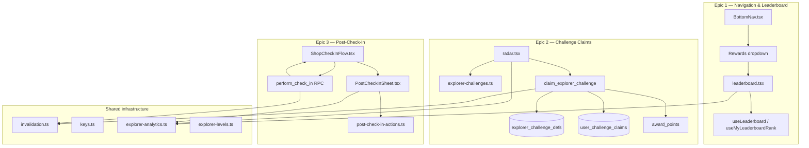
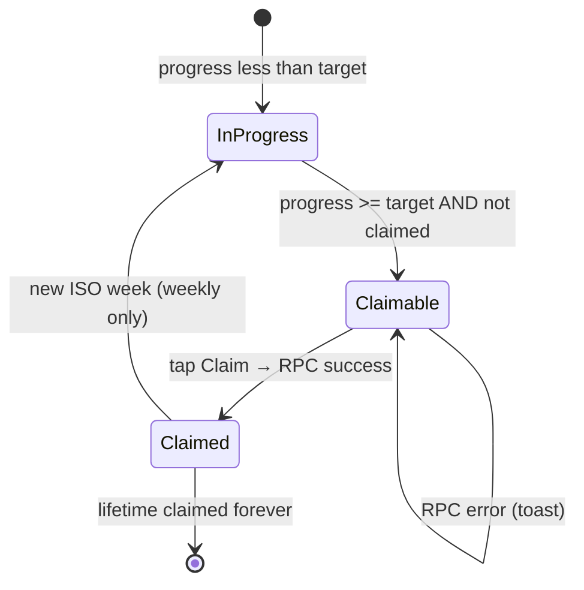
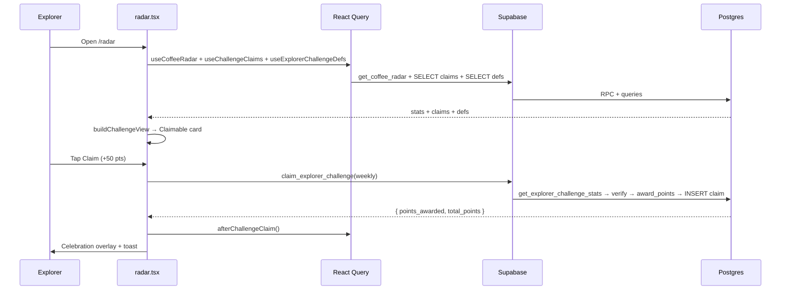
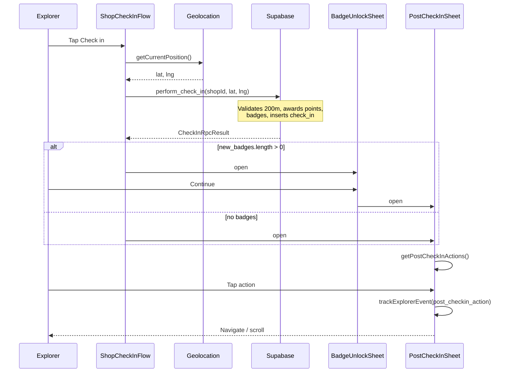
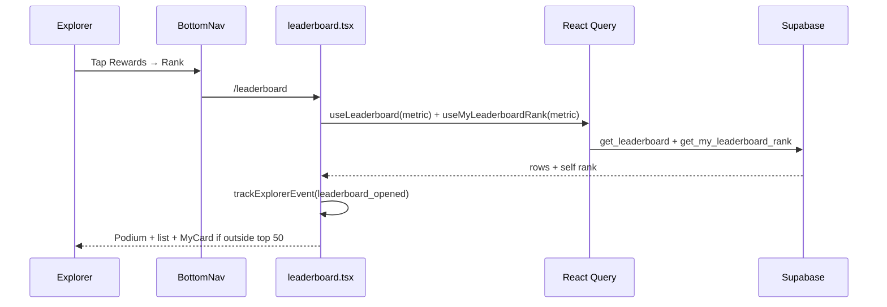

# Architecture: Explorer Engagement Sprint

**Leaderboard in nav · Challenge claims · Post-check-in sheet**

**Duration:** 2 weeks (10 working days)  
**Goal:** Turn passive UI into actionable engagement loops after every check-in and weekly visit to Radar.

**Related docs:** [SPRINT_EXPLORER_ENGAGEMENT.md](./SPRINT_EXPLORER_ENGAGEMENT.md) (sprint plan) · [PLAN_EXPLORER_GAPS.md](./PLAN_EXPLORER_GAPS.md) (follow-on) · [memory-bank/systemPatterns.md](./memory-bank/systemPatterns.md)

---

## Table of contents

1. [Sprint outcomes & success signals](#1-sprint-outcomes--success-signals)
2. [Baseline vs shipped state](#2-baseline-vs-shipped-state)
3. [System architecture overview](#3-system-architecture-overview)
4. [Epic 1 — Leaderboard in navigation](#4-epic-1--leaderboard-in-navigation)
5. [Epic 2 — Challenge claims (Radar)](#5-epic-2--challenge-claims-radar)
6. [Epic 3 — Post-check-in sheet](#6-epic-3--post-check-in-sheet)
7. [End-to-end process execution](#7-end-to-end-process-execution)
8. [Data model & RPC contracts](#8-data-model--rpc-contracts)
9. [Client layer: queries, cache, invalidation](#9-client-layer-queries-cache-invalidation)
10. [Analytics events](#10-analytics-events)
11. [Testing & verification](#11-testing--verification)
12. [File index](#12-file-index)
13. [Extensions (post-sprint)](#13-extensions-post-sprint)

---

## 1. Sprint outcomes & success signals

| Outcome | Success signal | Architecture enabler |
|---------|----------------|----------------------|
| Leaderboard is discoverable | ≥30% of weekly active explorers open `/leaderboard` from nav | Rewards dropdown → Rank; profile rank card; Radar footer link |
| Challenges reward real points | Claim flow end-to-end; ledger shows `challenge_reward` | `claim_explorer_challenge` RPC + `user_challenge_claims` |
| Check-in feels like a moment | Post-check-in sheet on every success; ≥1 follow-up action | `ShopCheckInFlow` → `PostCheckInSheet` + `getPostCheckInActions()` |

### Success metrics (2 weeks post-ship)

| Metric | Target |
|--------|--------|
| Leaderboard DAU / Explorer DAU | >25% |
| Challenge claims per week | >40% of users who complete a challenge |
| Post-check-in action rate | >50% tap at least one CTA before dismiss |
| Check-in → review conversion | +15% vs baseline |

---

## 2. Baseline vs shipped state

### 2.1 Before sprint (baseline)

| Feature | Status | Key files | Gap |
|---------|--------|-----------|-----|
| Leaderboard page | Built, **not in nav** | `leaderboard.tsx`, `get_leaderboard` | Low discoverability |
| Radar challenges | Display-only, client-computed | `radar.tsx` | No Claim, no server verify, no idempotency |
| Check-in success | Inline card (emoji, passport link) | `CoffeeShopPage.tsx` | No guided next steps |
| Points system | `award_points`, `points_ledger` | `perform_check_in`, wallet | Working |
| Nav | 5 slots, Rewards↓ without Rank | `BottomNav.tsx` | Engagement loop breaks after check-in |

**Core problem:** The engagement loop broke after check-in — no guided next step, no weekly reward claim, no competitive visibility.

### 2.2 After sprint (shipped)

| Feature | Status | Key files |
|---------|--------|-----------|
| Leaderboard | **Rank** under Rewards menu (2 taps) | `BottomNav.tsx`, `leaderboard.tsx` |
| Radar challenges | Claimable, DB-backed, celebration UI | `radar.tsx`, `explorer_challenge_defs`, `claim_explorer_challenge` |
| Check-in | Bottom sheet + guided CTAs | `ShopCheckInFlow.tsx`, `PostCheckInSheet.tsx` |
| Personal rank | Outside top 50 card + profile shortcut | `get_my_leaderboard_rank`, `profile.tsx` |
| Analytics | Client events → optional persistence | `explorer-analytics.ts` |

### 2.3 Navigation decision (plan vs ship)

The sprint plan originally recommended a **dedicated Rank tab** (6 nav items). **Shipped decision:** Rank lives in the **Rewards dropdown** with Passport and Wallet.

| Option | Pros | Cons | Decision |
|--------|------|------|----------|
| A. Rewards dropdown item | Groups rewards; avoids 6-tab crowding | 2 taps vs 1 | **Shipped** |
| B. New Rank tab | Highest discoverability | Tight on <360px phones | Deferred |
| C. Profile only | No nav change | Easy to miss | Rejected |

**Nav order (shipped):** Radar → Explore → Campaigns → **Rewards↓** (Passport · Rank · Wallet) → Profile

**Mobile mitigation:** `text-[9px]` labels; on viewports `<360px`, inactive tab labels use `sr-only` (icons primary).

---

## 3. System architecture overview

### 3.1 High-level component map



### 3.2 Data flow summary

```text
┌─────────────┐     GPS coords      ┌──────────────────┐
│   Explorer  │ ──────────────────► │ perform_check_in │
│  (browser)  │ ◄────────────────── │  (Postgres RPC)  │
└─────────────┘   CheckInRpcResult  └────────┬─────────┘
       │                                      │
       │                              badges, points,
       │                              check_ins row
       ▼                                      ▼
┌─────────────┐                      ┌──────────────────┐
│ BadgeUnlock │ (if new badges)      │  afterCheckIn()  │
│    Sheet    │ ──then──►            │  cache invalidate│
└─────────────┘                      └──────────────────┘
       │
       ▼
┌─────────────┐   reads radar stats   ┌──────────────────────┐
│ PostCheckIn │ ◄──────────────────── │ get_coffee_radar +   │
│    Sheet    │   + challenge claims  │ user_challenge_claims│
└─────────────┘                       └──────────────────────┘

┌─────────────┐   tap Claim           ┌────────────────────────┐
│    Radar    │ ────────────────────► │ claim_explorer_challenge│
│ ChallengeCard│ ◄────────────────── │ recomputes stats server │
└─────────────┘   points + ledger     └────────────────────────┘
```

---

## 4. Epic 1 — Leaderboard in navigation

### 4.1 Entry points

| Entry | Path | Component |
|-------|------|-----------|
| Primary | Bottom nav → Rewards → **Rank** | `BottomNav.tsx` → `/leaderboard` |
| Secondary | Radar → "Leaderboard →" link | `radar.tsx` Explorer Challenges footer |
| Secondary | Profile → "Your rank" card | `profile.tsx` + `useMyLeaderboardRank` |

### 4.2 Leaderboard page structure

**Route:** `src/routes/_authenticated/_explorer/leaderboard.tsx`

```text
AppPageHeader ("The Coffee Leaderboard")
├── Scope chips: Global | {profile.city}     [gaps sprint extension]
├── Metric chips: 5 metrics (horizontal scroll, cofex-chip-scroll-row)
├── QueryBoundary → leaderboard rows
│   ├── MyCard (if user outside top 50)
│   ├── Podium (top 3 reordered: 2nd, 1st, 3rd)
│   └── List rows (rank 4–50)
└── trackExplorerEvent("leaderboard_opened", { metric })
```

### 4.3 Metrics

| `LeaderboardMetric` | Label | Sort field | RPC `_metric` |
|---------------------|-------|------------|---------------|
| `points` | Explorer points | `total_points` | `points` (default) |
| `cafes` | Cafés visited | `cafes_visited` | `cafes` |
| `reviews` | Reviews written | `reviews_written` | `reviews` |
| `campaigns` | Campaigns completed | `campaigns_completed` | `campaigns` |
| `social` | Social posts | `social_posts` | `social` |

### 4.4 React Query hooks

**File:** `src/lib/queries/leaderboard.ts`

| Hook | Query key | RPC | Stale time |
|------|-----------|-----|------------|
| `useLeaderboard(metric, citySlug?)` | `["leaderboard", metric, scope]` | `get_leaderboard` | `STALE.leaderboard` |
| `useMyLeaderboardRank(metric, userId, citySlug?)` | `["myLeaderboardRank", metric, scope]` | `get_my_leaderboard_rank` | `STALE.myLeaderboardRank` |

**Personal rank card:** When `user_id` not in top-50 list, `myRankToLeaderboardRow(myRankQuery.data)` renders pinned `MyCard` with `outsideTop50` flag.

### 4.5 Explorer levels (shared)

**File:** `src/lib/explorer-levels.ts`

| Level | Min points | Icon |
|-------|------------|------|
| Rookie Explorer | 0 | Sprout |
| Coffee Seeker | 50 | Search |
| Espresso Hunter | 200 | Target |
| Cappuccino Master | 500 | Coffee |
| Coffee Nomad | 1,500 | Compass |
| Coffee Legend | 5,000 | Crown |

Used on leaderboard rows and profile level progress bar.

### 4.6 Bottom nav — Rewards dropdown

**File:** `src/components/app/BottomNav.tsx`

```typescript
const rewardsLinks = [
  { to: "/passport", label: "Passport", Icon: BookOpen },
  { to: "/leaderboard", label: "Rank", Icon: Trophy },
  { to: "/wallet", label: "Wallet", Icon: Wallet },
];
```

**Active state logic (`rewardsActiveState`):**

- `active` when pathname starts with `/passport`, `/wallet`, or `/leaderboard`
- Trigger shows **active sub-route** icon + label (e.g. Trophy + "Rank" on leaderboard)
- Dropdown opens **upward** (`side="top"`) above bottom nav

### 4.7 Acceptance criteria (Epic 1)

- [x] `/leaderboard` reachable in **2 taps** (Rewards → Rank)
- [x] Active state on Rewards nav when on leaderboard
- [x] All 5 metrics via React Query + `QueryBoundary`
- [x] Visual parity: `cofex-app-card`, `cofex-app-chip`, Lucide levels
- [x] E2E: Rewards → Rank → podium visible
- [x] `get_my_leaderboard_rank` + profile rank card

---

## 5. Epic 2 — Challenge claims (Radar)

### 5.1 Problem statement

Pre-sprint challenges in `radar.tsx` were derived from `get_coffee_radar` stats with:

- No **Claim** button
- No **server-side verification**
- No **idempotency** (client-only awards would be exploitable)
- Mixed periods: `weekly` / `new3` = ISO week; `streak` / `cities` = lifetime

### 5.2 Challenge catalog

**Source of truth (DB):** `explorer_challenge_defs`  
**Client mirror:** `src/lib/explorer-challenges.ts` (UI accents, `buildChallengeView`, fallbacks)

| ID | Title | `stat_key` | Target | Reward | `period_type` |
|----|-------|------------|--------|--------|---------------|
| `weekly` | Weekly Wanderer | `visits_this_week` | 5 | 50 pts | `weekly` |
| `new3` | Three New Doors | `new_shops_this_week` | 3 | 75 pts | `weekly` |
| `streak` | On Fire | `streak_days` | 5 | 100 pts | `lifetime` |
| `cities` | City Hopper | `cities_explored` | 3 | 150 pts | `lifetime` |

### 5.3 Period keys

| Period type | `period_key` format | Example |
|-------------|---------------------|---------|
| `weekly` | ISO week via Postgres `IYYY-"W"IW` | `2026-W24` |
| `lifetime` | Literal `lifetime` | `lifetime` |

**Client helper:** `getChallengePeriodKey(period, date)` in `explorer-challenges.ts`  
**Server helper:** `get_challenge_week_period_key()` RPC (canonical for claim state)

**Uniqueness:** `UNIQUE (user_id, challenge_id, period_key)` on `user_challenge_claims`.

### 5.4 Database schema

**Migration:** `supabase/migrations/20260614120000_explorer_challenge_claims.sql`  
**Defs migration:** `supabase/migrations/20260614140000_engagement_followup.sql`

```sql
CREATE TABLE public.user_challenge_claims (
  id uuid PRIMARY KEY DEFAULT gen_random_uuid(),
  user_id uuid NOT NULL REFERENCES auth.users(id) ON DELETE CASCADE,
  challenge_id text NOT NULL,
  period_key text NOT NULL,
  points_awarded int NOT NULL,
  claimed_at timestamptz NOT NULL DEFAULT now(),
  UNIQUE (user_id, challenge_id, period_key)
);

CREATE TABLE public.explorer_challenge_defs (
  id text PRIMARY KEY,
  title text NOT NULL,
  subtitle text NOT NULL,
  stat_key text NOT NULL,
  target int NOT NULL,
  reward int NOT NULL,
  period_type text NOT NULL CHECK (period_type IN ('weekly', 'lifetime')),
  sort_order int NOT NULL DEFAULT 0
);
```

**RLS:**

- `user_challenge_claims`: SELECT own rows only; INSERT via RPC only
- `explorer_challenge_defs`: public SELECT

### 5.5 RPC: `get_explorer_challenge_stats`

Recomputes progress server-side (must match radar personal stats):

| Field | Computation |
|-------|---------------|
| `visits_this_week` | Count `check_ins` since `date_trunc('week', now())` |
| `new_shops_this_week` | Distinct `coffee_shop_id` this week |
| `cities_explored` | Distinct shop `city` from all user check-ins |
| `streak_days` | Consecutive calendar days with check-ins (30-day window) |
| `week_period_key` | Current ISO week string |

### 5.6 RPC: `claim_explorer_challenge`

**Signature:** `claim_explorer_challenge(_challenge_id text) RETURNS jsonb`

**Execution steps:**

```text
1. auth.uid() → reject if NULL
2. SELECT * FROM explorer_challenge_defs WHERE id = _challenge_id
3. _stats := get_explorer_challenge_stats(_user)
4. _progress := _stats[_def.stat_key]
5. IF _progress < _def.target → RAISE 'Challenge not complete (x / y)'
6. _period_key := lifetime OR ISO week from _def.period_type
7. IF claim exists for (user, challenge, period) → RAISE 'Already claimed'
8. award_points(_user, _def.reward, 'challenge_reward', ...)
9. INSERT user_challenge_claims
10. RETURN { claim_id, challenge_id, period_key, points_awarded, total_points }
```

**`award_points` side effects:**

- Updates `profiles.total_points`
- Inserts `points_ledger` row (`source = 'challenge_reward'`)
- Inserts `notifications` row (label: "explorer challenge", link: `/wallet`)

### 5.7 Client layer

**File:** `src/lib/queries/radar.ts`

| Hook / function | Purpose |
|-----------------|---------|
| `useCoffeeRadar(center)` | `get_coffee_radar` — shops, campaigns, **stats** |
| `useChallengeClaims(userId)` | `user_challenge_claims` SELECT + `get_challenge_week_period_key` |
| `useClaimChallenge(userId)` | Mutation → `claim_explorer_challenge`; `onSuccess` → `afterChallengeClaim` |
| `useExplorerChallengeDefs()` | `explorer_challenge_defs` → `challengesFromDefs()` |

**View builder:** `buildChallengeView(stats, claims, weekPeriodKey, challenges)` returns per-challenge:

```typescript
{
  challenge, progress, complete, claimed, periodKey, pct,
  claimable: complete && !claimed
}
```

### 5.8 ChallengeCard state machine



| State | UI (`ChallengeCard`) |
|-------|----------------------|
| In progress | Progress bar, `pct%` |
| **Claimable** | `ring-2 ring-emerald-300/70` + Claim button |
| Claimed | Muted card, "Claimed ✓" badge |
| Claiming | Button disabled / spinner (`claimMutation.isPending`) |
| Celebrating | Overlay `+N pts` bounce (2.5s) |

### 5.9 Edge cases

| Case | Handling |
|------|----------|
| Complete but unclaimed before week ends | Weekly progress resets Monday; unclaimed points lost (subtitle: "Resets every Monday") |
| Stats stale after check-in | `afterCheckIn()` invalidates `coffeeRadar` + `challengeClaims` |
| Double-tap Claim | `UNIQUE` constraint + `isPending` guard |
| `streak` / `cities` already claimed | `claimed` true → no Claim button |
| RPC: incomplete | Toast with `Challenge not complete` message |
| RPC: already claimed | Toast with `Already claimed` |

### 5.10 Acceptance criteria (Epic 2)

- [x] Complete → Claim appears (not before)
- [x] Claim credits wallet; ledger `challenge_reward`
- [x] Second claim same period blocked server-side
- [x] Radar refreshes after claim and check-in
- [x] Celebration overlay + toast
- [x] Rules in `explorer_challenge_defs` (RPC reads DB, not hardcoded CASE)

---

## 6. Epic 3 — Post-check-in sheet

### 6.1 Problem statement

Pre-sprint `CheckInButton` showed a static success card (emoji, passport link). Missed:

- Review (+5 pts)
- Join active campaign
- Claimable weekly challenge
- Passport / explore continuation

### 6.2 Component hierarchy

```text
CoffeeShopPage.tsx / MapShopSheet.tsx
└── ShopCheckInFlow.tsx
    ├── [Check in button] → rpcPerformCheckIn
    ├── BadgeUnlockSheet.tsx     (if result.new_badges.length > 0)
    └── PostCheckInSheet.tsx     (after badges dismissed or none)
```

### 6.3 ShopCheckInFlow execution

**File:** `src/components/app/ShopCheckInFlow.tsx`

```text
1. getCurrentPosition()                    // src/lib/geo.ts
2. rpcPerformCheckIn({ shopId, lat, lng }) // perform_check_in RPC
3. parseCheckInResult(data)
4. IF new_badges → BadgeUnlockSheet open
   ELSE → PostCheckInSheet open
5. afterCheckIn(queryClient, userId)
6. trackExplorerEvent("badge_unlocked") per badge
```

**Checked-in state:** Button replaced with "You're checked in" + "View summary" reopening sheet.

### 6.4 CheckInRpcResult shape

**File:** `src/lib/rpc/client.ts`

```typescript
interface CheckInRpcResult {
  check_in_id: string;
  points_awarded: number;      // typically +10
  total_points: number;
  total_check_ins: number;
  new_badges: { slug: string; name: string }[];
}
```

### 6.5 PostCheckInSheet API

**File:** `src/components/app/PostCheckInSheet.tsx`

```typescript
interface PostCheckInSheetProps {
  open: boolean;
  onOpenChange: (open: boolean) => void;
  result: CheckInRpcResult;
  shop: { slug: string; name: string; citySlug?: string };
  campaigns?: { id: string; title: string; reward_description?: string | null }[];
  onWriteReview: () => void;
}
```

**UI:** Radix `Sheet` `side="bottom"`, max-height `85dvh`, `z-[1200]`.

### 6.6 Action row priority

**Pure ordering:** `src/lib/post-check-in-actions.ts` → `getPostCheckInActions()`

| Priority | `PostCheckInActionId` | Condition | Destination |
|----------|----------------------|-----------|-------------|
| 1 | `claimable_challenge` | `buildChallengeView` has `claimable` | `/radar` |
| 2 | `city_almost_done` | City progress at target−1 | `/city/$city` |
| 3 | `write_review` | Always | `onWriteReview()` scroll |
| 4 | `campaign` | `campaigns[0]` exists | `/campaign/$id` |
| 5 | `passport` | Always | `/passport` |
| 6 | `explore` | Always | `/explore` |

**Sheet data dependencies (when open):**

- `useChallengeClaims(userId)`
- `useCoffeeRadar(null)` — stats for challenge progress
- `useExplorerChallengeDefs()`
- `useCityCollectionProgress(citySlug, userId)` — gaps extension

### 6.7 Sheet layout (wireframe)

```text
┌─────────────────────────────────────┐
│  ✓ Check-in confirmed!              │
│  +10 pts · 240 total · Café Name      │
├─────────────────────────────────────┤
│  WHAT'S NEXT?                         │
│  ┌─────────────────────────────┐    │
│  │ 🏆 Claim Weekly Wanderer     │    │  ← if claimable
│  └─────────────────────────────┘    │
│  ┌─────────────────────────────┐    │
│  │ ★ Write a review      +5 pts │    │
│  └─────────────────────────────┘    │
│  ┌─────────────────────────────┐    │
│  │ 📣 Join EEFFOC campaign      │    │  ← if campaign exists
│  └─────────────────────────────┘    │
│  ┌─────────────────────────────┐    │
│  │ 📖 View passport stamp       │    │
│  └─────────────────────────────┘    │
│  ┌─────────────────────────────┐    │
│  │ 🧭 Explore more cafés        │    │
│  └─────────────────────────────┘    │
│  Stamp saved · Points added to wallet │
└─────────────────────────────────────┘
```

### 6.8 Analytics on sheet

| Event | When | Props |
|-------|------|-------|
| `post_checkin_sheet_opened` | `open === true` | `shop_slug` |
| `city_collection_viewed` | sheet open + city | `city_slug` |
| `post_checkin_action` | any CTA tap | `action` |

### 6.9 Acceptance criteria (Epic 3)

- [x] Successful check-in opens sheet (or badge sheet first)
- [x] Points, total, visit count in header
- [x] ≥3 conditional action rows
- [x] Review CTA triggers scroll via parent `onWriteReview`
- [x] Campaign row only when campaigns passed in
- [x] Dismiss preserves check-in on shop page
- [x] Claimable challenge row when ready

---

## 7. End-to-end process execution

### 7.1 Weekly Radar visit → claim flow



### 7.2 Check-in → post-check-in flow



### 7.3 Leaderboard open flow



### 7.4 Sprint build order (recommended)

| Day | Focus | Unblocks |
|-----|-------|----------|
| 1–2 | DB + RPC + `explorer-challenges.ts` | Epic 2 |
| 2–4 | Leaderboard rebrand + nav | Epic 1 (parallel after day 2) |
| 4–7 | Challenge claim UI on Radar | Epic 2 UI |
| 7–9 | Post-check-in sheet | Epic 3 |
| 9–10 | Tests, invalidation audit, polish | All |

Epics 1 and 2 can run **in parallel** after Day 2 with two developers.

---

## 8. Data model & RPC contracts

### 8.1 Tables touched by this sprint

| Table | Role |
|-------|------|
| `check_ins` | Source for challenge stats + check-in loop |
| `profiles` | `total_points`, display_name, city, avatar |
| `points_ledger` | Audit trail; `source = 'challenge_reward'` |
| `notifications` | Points earned toasts in-app |
| `user_challenge_claims` | Idempotent claim records |
| `explorer_challenge_defs` | Challenge rules (RPC reads) |
| `badges` / `user_badges` | Returned in check-in result |
| `reviews` | Leaderboard metric |
| `campaign_redemptions` | Leaderboard metric |
| `social_submissions` | Leaderboard metric |

### 8.2 RPC reference

| RPC | Auth | Input | Output |
|-----|------|-------|--------|
| `perform_check_in` | required | `_shop_id`, `_lat`, `_lng` | `CheckInRpcResult` jsonb |
| `get_coffee_radar` | optional | `_lat`, `_lng`, `_radius_km` | Radar payload + stats |
| `get_explorer_challenge_stats` | required | `_user uuid` | stats jsonb |
| `claim_explorer_challenge` | required | `_challenge_id text` | claim result jsonb |
| `get_challenge_week_period_key` | required | — | `text` ISO week |
| `get_leaderboard` | optional | `_metric`, `_limit`, `_city_slug?` | row set |
| `get_my_leaderboard_rank` | required | `_metric`, `_city_slug?` | self rank jsonb |
| `award_points` | internal | user, delta, source, … | new balance int |
| `log_explorer_event` | required | `_event_name`, `_props` | void (gaps sprint) |

### 8.3 Points ledger sources (engagement sprint)

| `source` | Trigger |
|----------|---------|
| `check_in` | `perform_check_in` |
| `review` | Review upsert trigger |
| `challenge_reward` | `claim_explorer_challenge` |
| `campaign_redemption` | Campaign redeem |
| `social_post` | Approved submission |

---

## 9. Client layer: queries, cache, invalidation

### 9.1 Query keys (engagement-related)

**File:** `src/lib/queries/keys.ts`

```typescript
leaderboard: (metric) => ["leaderboard", metric]
myLeaderboardRank: (metric) => ["myLeaderboardRank", metric]
challengeClaims: (userId) => ["challengeClaims", userId]
explorerChallengeDefs: () => ["explorerChallengeDefs"]
coffeeRadar: (lat, lng) => ["coffeeRadar", lat, lng]
```

Scoped variants append `"global"` or city slug as third key segment.

### 9.2 Invalidation graph

**File:** `src/lib/queries/invalidation.ts`

**`afterCheckIn(qc, userId)`** — called from `ShopCheckInFlow` on success:

```text
profile, passport, wallet, coffeeShops,
challengeClaims, coffeeRadar,
leaderboard, myLeaderboardRank,
userCityCollections, cityCollection
```

**`afterChallengeClaim(qc, userId)`** — called from `useClaimChallenge` on success:

```text
challengeClaims, wallet, profile,
coffeeRadar, leaderboard, myLeaderboardRank
```

### 9.3 Shared infrastructure

| Module | Purpose |
|--------|---------|
| `explorer-levels.ts` | Profile + leaderboard level display |
| `explorer-challenges.ts` | Challenge defs, period keys, `buildChallengeView` |
| `post-check-in-actions.ts` | Testable CTA ordering |
| `rpc/client.ts` | `rpcPerformCheckIn`, `parseCheckInResult`, claim helpers |
| `explorer-analytics.ts` | Debounced event batch |

---

## 10. Analytics events

**File:** `src/lib/explorer-analytics.ts`

| Event | Emitter | Props |
|-------|---------|-------|
| `leaderboard_opened` | `leaderboard.tsx` | `metric` |
| `challenge_claimed` | `radar.tsx` | `challenge_id`, `points` |
| `post_checkin_sheet_opened` | `PostCheckInSheet.tsx` | `shop_slug` |
| `post_checkin_action` | `PostCheckInSheet.tsx` | `action` |
| `badge_unlocked` | `ShopCheckInFlow.tsx` | `slug`, `source` |

**Persistence (gaps sprint):** batched flush → `log_explorer_event` RPC → `explorer_events` table (fail-silent).

**DEV:** `console.debug("[explorer-analytics]", …)` + `window` event `cofex:explorer`.

---

## 11. Testing & verification

### 11.1 Test matrix

| Layer | File | Coverage |
|-------|------|----------|
| Unit | `explorer-challenges.test.ts` | Period keys, `buildChallengeView`, countdown |
| Unit | `post-check-in-actions.test.ts` | Action ordering (4 scenarios) |
| RPC integration | `client.integration.test.ts` | Check-in; claim success / incomplete / already claimed |
| Invalidation | `invalidation.test.ts` | Key lists after check-in / claim |
| E2E | `e2e/authenticated.spec.ts` | Rewards → Rank; check-in → passport CTA |

### 11.2 Gaps (documented, not blocking ship)

- `BadgeUnlockSheet` component test
- `PostCheckInSheet` component test
- `limited-expired` claim RPC test (gaps sprint challenges)

### 11.3 Manual smoke checklist

```text
[ ] Rewards → Rank → switch all 5 metrics
[ ] Profile rank card matches leaderboard
[ ] Radar: complete weekly challenge → Claim → wallet +50
[ ] Radar: claim again → error toast
[ ] Check in at shop → sheet opens → review scroll works
[ ] Check in with new badge → badge sheet → post-check-in sheet
[ ] After check-in, Radar stats reflect new visit
```

---

## 12. File index

### 12.1 Migrations

| File | Contents |
|------|----------|
| `20260614120000_explorer_challenge_claims.sql` | `user_challenge_claims`, `get_explorer_challenge_stats`, `claim_explorer_challenge` v1, `award_points` label |
| `20260614140000_engagement_followup.sql` | `explorer_challenge_defs`, `get_my_leaderboard_rank`, `claim_explorer_challenge` v2 (reads defs) |

### 12.2 Routes

| File | Epic |
|------|------|
| `src/routes/_authenticated/_explorer/leaderboard.tsx` | 1 |
| `src/routes/_authenticated/_explorer/radar.tsx` | 2 |
| `src/routes/_authenticated/_explorer/profile.tsx` | 1 (rank card) |

### 12.3 Components

| File | Epic |
|------|------|
| `src/components/app/BottomNav.tsx` | 1 |
| `src/components/app/ShopCheckInFlow.tsx` | 3 |
| `src/components/app/PostCheckInSheet.tsx` | 3 |
| `src/components/app/BadgeUnlockSheet.tsx` | Extension |
| `src/components/app/CoffeeShopPage.tsx` | 3 (hosts flow) |

### 12.4 Libraries

| File | Epic |
|------|------|
| `src/lib/explorer-challenges.ts` | 2 |
| `src/lib/explorer-levels.ts` | 1 |
| `src/lib/post-check-in-actions.ts` | 3 |
| `src/lib/explorer-analytics.ts` | All |
| `src/lib/queries/leaderboard.ts` | 1 |
| `src/lib/queries/radar.ts` | 2 |
| `src/lib/queries/invalidation.ts` | All |
| `src/lib/rpc/client.ts` | 2, 3 |

---

## 13. Extensions (post-sprint)

The [Explorer Gaps sprint](./PLAN_EXPLORER_GAPS.md) extended engagement architecture without replacing it:

| Extension | Impact on engagement flows |
|-----------|---------------------------|
| `BadgeUnlockSheet` | Inserted before `PostCheckInSheet` when `new_badges` |
| City collections | `city_almost_done` action row in post-check-in sheet |
| City leaderboard scope | `get_leaderboard` + `get_my_leaderboard_rank` accept `_city_slug` |
| Limited challenges | `explorer_challenge_defs` + `period_type: limited`; Radar "Seasonal" section |
| Map check-in | `MapShopSheet` reuses `ShopCheckInFlow` |
| `explorer_events` | All engagement analytics events persisted for admin KPIs |

---

## Out of scope (engagement sprint)

Deferred to Phase 3+ or [PLAN_EXPLORER_GAPS.md](./PLAN_EXPLORER_GAPS.md):

- Friends leaderboard
- Realtime leaderboard (Supabase Realtime)
- Push notifications for claimable challenges
- Partner mobile verify flow
- Share card / haptics / `CheckInProvider` abstraction

---

*Last updated: June 11, 2026. Refresh when RPC signatures or nav structure change.*
