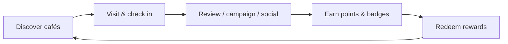
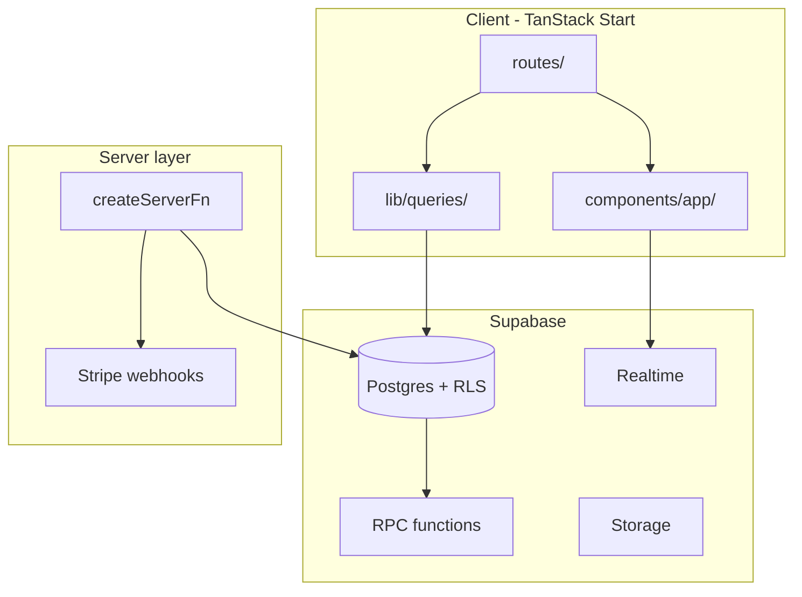

# CO:FE(X) — Development Plan

This document is the master roadmap for taking CO:FE(X) from its current MVP state to a launch-ready product, while establishing patterns that keep future features fast and consistent.

**Last updated:** June 2026  
**Horizon:** ~12 weeks (adjustable by team size)

---

## 1. Vision and principles

### Product loop



### Engineering principles (apply to every feature)

| Principle | What it means in practice |
| --- | --- |
| **Rules in Postgres** | Business logic (points, eligibility, cooldowns) lives in RPCs + RLS, not scattered in React |
| **Query hooks first** | New data fetching goes in `src/lib/queries/` with TanStack Query — not raw `useEffect` |
| **Mobile-first UX** | Design for thumb reach, bottom nav, one primary action per screen |
| **Progressive disclosure** | Show the happy path; tuck advanced options behind “More” / filters |
| **Fail gracefully** | Every async surface has loading, empty, and error states |
| **Ship in vertical slices** | Each phase delivers something users can touch, not “backend only” |

### Usability standards (Definition of Done for UI)

Every new or updated screen must include:

1. **Loading** — skeleton or spinner, never a blank page  
2. **Empty** — illustration + one clear CTA (“Explore cafés”, “Join a campaign”)  
3. **Error** — human message + retry action  
4. **Success feedback** — toast or inline confirmation (Sonner is already in `__root.tsx`)  
5. **Accessibility** — focus order, labels on inputs, 44px tap targets on mobile  
6. **Copy** — CO:FE(X) voice: warm, concise, coffee-native (avoid jargon)

---

## 2. Current baseline

### Done recently

- Lovable removed; rebranded as **CO_FE_X**
- `.env` untracked; `.env.example` added
- GPS check-ins (200 m) + admin moderation RPCs (migration `20260611120000_co_fe_x_improvements.sql`)
- Profile page, admin console (partners, users, campaigns, analytics, revenue summary)
- React Query hooks for explore, profile, admin (`src/lib/queries/`)
- Vitest + geo tests; README

### Known gaps

| Area | Status |
| --- | --- |
| Café reviews UI | DB + triggers exist; no explorer write UI on shop page |
| Auth | Sign in/up only; no reset password, email verify UX |
| React Query | ~6 routes migrated; wallet, passport, campaigns, partner still on `useEffect` |
| Notifications | Polling bell; no realtime, push, or email |
| Billing | Placeholder admin revenue page |
| PWA / SEO | Landing only; shop pages auth-gated |
| Tests / CI | 4 unit tests; no CI, no E2E |
| Server functions | Example only; sensitive ops still client-side |

---

## 3. Architecture target (12-week end state)



### Folder conventions for new work

```
src/
  lib/queries/          # One file per domain: reviews.ts, wallet.ts, …
  lib/api/              # createServerFn handlers (Stripe, webhooks, admin batch)
  components/app/       # Product components (ReviewForm, OnboardingStep, …)
  components/patterns/  # NEW: EmptyState, PageHeader, AsyncBoundary
  routes/               # Thin route files — compose hooks + components
docs/
  DEVELOPMENT_PLAN.md   # This file
  ADR/                  # Architecture decision records (optional, 1-pagers)
```

### Shared UI patterns to introduce (Phase 1)

Create reusable wrappers so usability stays consistent:

| Component | Purpose |
| --- | --- |
| `EmptyState` | Icon + title + description + CTA button |
| `PageHeader` | Eyebrow, title, optional action |
| `QueryBoundary` | Wraps `useQuery` children with loading/error/empty |
| `FormField` | Label + input + inline error (extend shadcn `Form`) |

---

## 4. Phase overview

| Phase | Weeks | Theme | User-visible outcome |
| --- | --- | --- | --- |
| **0** | 0.5 | Foundation | Migration applied, secrets rotated, CI green |
| **1** | 1–2 | Trust loop | Reviews, auth polish, shared UX patterns |
| **2** | 3–4 | Data layer | Full React Query migration, invalidation graph |
| **3** | 5–6 | Engagement | Onboarding, notifications realtime, empty states |
| **4** | 7–8 | Monetization | Stripe subscriptions + campaign billing |
| **5** | 9–10 | Reach | PWA, public SEO pages, performance |
| **6** | 11–12 | Scale | E2E tests, server functions, abuse controls |

Phases can overlap: e.g. start CI in Phase 0 and expand tests each phase.

---

## 5. Phase 0 — Foundation (Week 0)

**Goal:** Safe, reproducible environment before feature work.

### Tasks

| # | Task | Solution | Owner | Done when |
| --- | --- | --- | --- | --- |
| 0.1 | Apply all migrations | `supabase db push` or dashboard SQL | DevOps | RPCs `perform_check_in(lat,lng)`, admin review fns exist |
| 0.2 | Rotate Supabase keys | New anon key; update `.env`; never recommit | Admin | Old keys revoked |
| 0.3 | Google OAuth | Supabase Auth → Google; redirect URLs for dev + prod | Admin | Google sign-in works end-to-end |
| 0.4 | CI pipeline | GitHub Actions: `npm ci`, `lint`, `test`, `build` | Eng | PR checks required |
| 0.5 | Supabase types sync | Script: `supabase gen types typescript --local > src/integrations/supabase/types.ts` | Eng | Documented in README |

### CI workflow sketch

```yaml
# .github/workflows/ci.yml
on: [push, pull_request]
jobs:
  verify:
    runs-on: ubuntu-latest
    steps:
      - uses: actions/checkout@v4
      - uses: actions/setup-node@v4
        with: { node-version: 20 }
      - run: npm ci
      - run: npm run lint
      - run: npm run test
      - run: npm run build
```

---

## 6. Phase 1 — Trust loop (Weeks 1–2)

**Goal:** Complete the core explorer → café → feedback loop and fix auth gaps.

### 1.1 Café reviews (explorer)

**Problem:** `reviews` table + `trg_reviews_award` trigger (+5 pts) exist; shop page has no UI.

**Solution:**

1. Add `src/lib/queries/reviews.ts`:
   - `useShopReviews(shopId)` — list with profile display names
   - `useMyReview(shopId, userId)` — current user’s review if any
   - `useUpsertReview()` — insert/update (unique per user+shop)
2. Add `src/components/app/ReviewSection.tsx`:
   - Star rating (1–5), optional body (max 500 chars)
   - Show aggregate rating on shop header (avg + count)
   - Gate: encourage check-in first (soft prompt, not hard block initially)
3. Integrate into `src/routes/_authenticated/coffee.$slug.tsx`
4. Invalidate `queryKeys.coffeeShop(slug)` and wallet/profile on success

**UX notes:**

- After submit: toast “+5 points — thanks for the review!”
- Edit own review inline; show “You reviewed this café” state
- Empty reviews: “Be the first to review” + CTA

**Acceptance criteria:**

- [ ] Explorer can submit 1–5 star review + text per shop  
- [ ] Points appear in wallet ledger (`source: review`)  
- [ ] Partner dashboard review count increments  
- [ ] Leaderboard `reviews_written` updates  

### 1.2 Auth completeness

**Solution:**

| Feature | Implementation |
| --- | --- |
| Forgot password | `/auth/forgot` → `supabase.auth.resetPasswordForEmail` |
| Reset password | `/auth/reset` (handles hash from email link) → `updateUser({ password })` |
| Email verification banner | `ExplorerLayout` banner if `!user.email_confirmed_at` |
| Session expiry | Global `onAuthStateChange` → redirect to `/auth` with `?next=` |
| Auth errors | Map Supabase error codes to friendly copy |

**Files:** extend `src/routes/auth.tsx` or split `auth.forgot.tsx`, `auth.reset.tsx`

**UX notes:**

- Preserve `redirect` search param so post-login returns to intended page  
- Password rules shown before submit (min 6 chars, etc.)

### 1.3 Shared UX patterns

**Solution:** Add `src/components/patterns/` with `EmptyState`, `PageHeader`, `QueryBoundary`.

**Rollout order:** passport → wallet → campaigns (highest empty-state pain)

---

## 7. Phase 2 — Data layer (Weeks 3–4)

**Goal:** One consistent data-fetching model; predictable cache updates after user actions.

### 2.1 Query hook migration map

| Route / feature | New hook file | Priority |
| --- | --- | --- |
| `wallet.tsx` | `lib/queries/wallet.ts` | P0 |
| `passport.tsx` | `lib/queries/passport.ts` | P0 |
| `campaigns.tsx`, `campaign.$id.tsx` | `lib/queries/campaigns.ts` | P0 |
| `coffee.$slug.tsx` | `lib/queries/coffee-shops.ts` (extend) | P1 |
| `leaderboard.tsx` | `lib/queries/leaderboard.ts` | P1 |
| `partner.*` routes | `lib/queries/partner.ts` | P1 |
| `NotificationsBell` | `lib/queries/notifications.ts` | P2 |

### 2.2 Invalidation graph

Document central invalidation in `src/lib/queries/invalidation.ts`:

```typescript
export function afterCheckIn(qc: QueryClient, userId: string, shopId: string) {
  qc.invalidateQueries({ queryKey: queryKeys.profile(userId) });
  qc.invalidateQueries({ queryKey: queryKeys.passport(userId) });
  qc.invalidateQueries({ queryKey: queryKeys.wallet(userId) });
  qc.invalidateQueries({ queryKey: ["coffeeShop"] });
}
```

Call from check-in mutation, review mutation, campaign redeem, etc.

### 2.3 Route loaders (optional enhancement)

For critical paths, add TanStack Router `loader` + `queryClient.ensureQueryData` on:

- `/explore` — prefetch coffee shops  
- `/coffee/$slug` — prefetch shop + reviews  

Keeps first paint fast without blocking on full React Query migration.

### 2.4 Type safety

- Regenerate Supabase types after each migration  
- Remove `as any` in partner submissions, campaign joins  
- Add `src/integrations/supabase/helpers.ts` for typed RPC wrappers  

---

## 8. Phase 3 — Engagement & usability (Weeks 5–6)

**Goal:** Guide new users, re-engage existing ones, polish rough edges.

### 3.1 Onboarding flow

**Solution:** `src/routes/_authenticated/_explorer/onboarding.tsx` (or modal wizard)

| Step | Content | Data captured |
| --- | --- | --- |
| 1 | Welcome + value prop | — |
| 2 | Pick home city | `profiles.city` |
| 3 | Coffee preferences (tags) | new `profiles.preferences jsonb` or join table |
| 4 | How check-ins work (GPS) | — |
| 5 | Drop into explore | — |

**Trigger:** `profiles.onboarding_completed_at IS NULL` → redirect once after first login.

**Migration:**

```sql
ALTER TABLE profiles ADD COLUMN onboarding_completed_at timestamptz;
ALTER TABLE profiles ADD COLUMN preferences jsonb DEFAULT '{}';
```

### 3.2 Empty states audit

| Screen | Empty message | CTA |
| --- | --- | --- |
| Passport | “No stamps yet” | Explore nearby |
| Wallet | “No points yet” | Check in at a café |
| Campaigns | “No active campaigns in your area” | Widen radius / change city |
| Partner submissions | “No pending posts” | Share campaign link |

### 3.3 Notifications upgrade

**Current:** 30s polling in `NotificationsBell.tsx`

**Target:**

1. **Realtime (Phase 3a):** Supabase channel `notifications:user_id=eq.{id}` → instant bell update  
2. **Push (Phase 3b):** Web Push API + service worker; store `push_subscription` on profile  
3. **Email (Phase 3c):** Supabase Edge Function or Resend for digest emails  

**Notification types to ensure DB triggers cover:**

- Badge unlocked  
- Campaign joined / reward ready  
- Partner application approved/rejected  
- Points expiring soon (wallet already has expiry logic)

### 3.4 Profile enhancements

- Avatar upload → Supabase Storage bucket `avatars/{user_id}/`  
- Public profile slug `/explorer/@handle` (optional, Phase 3+)  
- Activity summary (recent check-ins, badges)

---

## 9. Phase 4 — Monetization (Weeks 7–8)

**Goal:** Partner revenue via Stripe; gate premium features.

### 4.1 Data model

```sql
CREATE TABLE shop_subscriptions (
  id uuid PRIMARY KEY DEFAULT gen_random_uuid(),
  coffee_shop_id uuid REFERENCES coffee_shops(id) NOT NULL,
  stripe_customer_id text,
  stripe_subscription_id text,
  plan text NOT NULL DEFAULT 'listing', -- listing | pro | campaign_boost
  status text NOT NULL DEFAULT 'trialing',
  current_period_end timestamptz,
  created_at timestamptz DEFAULT now()
);
```

### 4.2 Stripe integration

| Piece | Location |
| --- | --- |
| Checkout session | `src/lib/api/stripe.createCheckout.ts` (createServerFn) |
| Customer portal | `src/lib/api/stripe.createPortal.ts` |
| Webhook handler | `src/lib/api/stripe.webhook.ts` — verify signature, update `shop_subscriptions` |
| Partner billing UI | Replace `admin.revenue.tsx` placeholder; add `/partner/billing` |

**Gating rules:**

- Free tier: 1 listing, 1 active campaign  
- Pro: unlimited campaigns, analytics export, promoted discover slot  
- Enforce in `CampaignWizard` + shop publish RPC  

### 4.3 Admin revenue dashboard

- MRR, active subscriptions, churn  
- Query Stripe API via server function (never expose secret key to client)

---

## 10. Phase 5 — Reach & performance (Weeks 9–10)

**Goal:** Discoverable without app install; fast on mid-range phones.

### 5.1 Public SEO routes

Split authenticated vs public:

| Public route | SSR | Content |
| --- | --- | --- |
| `/coffee/:slug` | Yes | Shop name, photos, hours, reviews (read-only) |
| `/city/:city` | Yes | Top cafés, active campaigns |
| `/` | Yes | Landing (exists) |

**Implementation:**

- Move shop detail to `src/routes/coffee.$slug.tsx` (public) with CTA “Sign in to check in”  
- Keep authenticated actions on `_authenticated/coffee/$slug` or same route with conditional UI  
- `head()` per route: title, description, og:image from shop cover  

### 5.2 PWA

- `public/manifest.webmanifest` — name, icons, theme colors from `--cofex-*`  
- Vite PWA plugin or manual service worker for shell cache  
- Install prompt on landing after engagement heuristic  

### 5.3 Performance

| Issue | Fix |
| --- | --- |
| Recharts 500 kB chunk | Dynamic import on partner dashboard only |
| Leaflet | Already lazy on explore; preload on hover optional |
| Images | Supabase transform URLs; WebP; explicit width/height |
| Query stale times | Tune per domain (shops: 5 min, wallet: 0) |

**Target metrics:** LCP < 2.5s, CLS < 0.1 on `/explore` (mobile 4G throttled)

---

## 11. Phase 6 — Scale & safety (Weeks 11–12)

**Goal:** Confidence to open beta wider.

### 6.1 Testing pyramid

```
        E2E (Playwright)     ~10 critical paths
       /                    \
  Integration (RPC mocks)    ~30 tests
 /                            \
Unit (geo, utils, hooks)       ~50+ tests
```

**Priority E2E flows:**

1. Sign up → onboarding → explore  
2. Check in at shop (mock geolocation)  
3. Join campaign → redeem  
4. Partner create campaign  
5. Admin approve partner  

### 6.2 Server functions for sensitive ops

Move to `createServerFn` + service role:

- Stripe webhooks  
- Bulk admin exports  
- Future: fraud review queue  

Keep RPCs for user-scoped actions (check-in, join campaign) — RLS + `auth.uid()` is correct there.

### 6.3 Abuse prevention

| Vector | Mitigation |
| --- | --- |
| GPS spoofing | Server distance check (done); optional captcha on redeem |
| Review spam | Require check-in in last 30 days (RPC or trigger) |
| Referral fraud | Cap referral bonuses per IP / device (server fn) |
| RPC hammering | Supabase rate limits + Postgres `pg_sleep` throttles on hot RPCs |

### 6.4 Observability

- Structured client errors → `reportAppError` (extend to Sentry later)  
- Supabase logs for failed RPCs  
- Admin analytics: daily active explorers, check-ins per city  

---

## 12. Future features backlog (post-launch)

Prioritize by user feedback after beta:

| Feature | Depends on | Notes |
| --- | --- | --- |
| Friend leaderboards | Social graph table | Invite link → follow friends |
| Promoted discover slots | Stripe Pro plan | Banner component on explore |
| Menu highlights per shop | Partner shop editor | JSON column on `coffee_shops` |
| Multi-language | i18n (e.g. `paraglide`) | Start with EN + PT for Lisbon |
| Native apps | Capacitor wrapper | Reuse PWA + deep links |
| Mapbox upgrade | API key + budget | Better styling than OSM tiles |

---

## 13. Development workflow

### Branch strategy

- `main` — production  
- `develop` — integration (optional)  
- `feat/phase-1-reviews`, `fix/check-in-distance`, etc.

### PR checklist

- [ ] Loading / empty / error states  
- [ ] Query hooks + invalidation (if data changes)  
- [ ] Migration file if schema changes  
- [ ] Types regenerated  
- [ ] Test(s) added or updated  
- [ ] Mobile viewport checked (375px)  

### Release cadence

- **Weekly** minor releases during active development  
- **Migration first:** apply DB changes before deploying client that depends on them  
- **Feature flags:** env `VITE_FEATURE_STRIPE=false` until Phase 4 ready  

---

## 14. Success metrics by phase

| Phase | Metric | Target |
| --- | --- | --- |
| 1 | Review submission rate | >15% of check-ins within 7 days |
| 1 | Auth completion | <5% drop-off on sign-up |
| 2 | Client duplicate fetches | Near zero on navigations (React Query devtools) |
| 3 | D7 retention | >25% (beta cohort) |
| 4 | Partner conversion | >10% of approved partners on paid plan |
| 5 | Organic landing → sign-up | >8% |
| 6 | P0 bug escape rate | Zero check-in/payment bugs in beta |

---

## 15. Immediate next steps (this week)

**Phase 0 — done in repo**

- [x] CI workflow (`.github/workflows/ci.yml`)
- [x] `npm run db:types` / `npm run db:push` scripts
- [ ] Apply migration on Supabase: `npm run db:push`
- [ ] Rotate Supabase anon key if `.env` was ever pushed

**Phase 1 — done in repo**

- [x] Shared patterns: `EmptyState`, `PageHeader`, `QueryBoundary`
- [x] Café reviews on shop page (`ReviewSection`)
- [x] Auth: forgot/reset password, email banner, `?next=` redirect
- [x] Empty states on passport, wallet, campaigns

**Phase 2 — done in repo**

- [x] `lib/queries/wallet.ts` + `wallet.tsx` on React Query
- [x] `lib/queries/passport.ts` + `passport.tsx` on React Query
- [x] `lib/queries/campaigns.ts` + `campaigns.tsx` / `campaign.$id.tsx` on React Query
- [x] Central invalidation in `lib/queries/invalidation.ts` wired to check-in, review, wallet, campaign mutations

**Phase 3 — done in repo**

- [x] Onboarding wizard (`/onboarding`) with city + coffee preferences
- [x] Redirect guard when `onboarding_completed_at` is null
- [x] Realtime notifications via React Query + Supabase channel (replaces 30s polling)
- [x] Avatar upload to `avatars` storage bucket on profile page
- [ ] Apply migration: `npm run db:push`

**Phase 4 — done in repo**

- [x] `shop_subscriptions` table + plan enforcement triggers (campaigns, shop listings)
- [x] Stripe checkout, billing portal, webhook (`/api/stripe/webhook`)
- [x] Partner billing page (`/partner/billing`)
- [x] Admin revenue dashboard with MRR + plan mix
- [x] CampaignWizard + partner UX gating with upgrade CTAs
- [ ] Apply migration: `npm run db:push`
- [ ] Configure Stripe products/prices + webhook endpoint

**Phase 5 — done in repo**

- [x] Public SEO routes: `/coffee/$slug` (SSR + OG tags) and `/city/$city`
- [x] Shared `CoffeeShopPage` with sign-in CTA for guests, check-in for explorers
- [x] PWA: `manifest.webmanifest`, shell service worker, install prompt on landing
- [x] Performance: lazy Recharts on partner dashboard, Supabase WebP transforms, tuned stale times

**Phase 6 — done in repo**

- [x] Abuse prevention migration: review requires check-in (30d), check-in rate limit (20/hr)
- [x] `get_admin_engagement` RPC + admin analytics UI (DAU, check-ins, cities)
- [x] Client check-in validation module (`src/lib/check-in.ts`) + RPC wrappers (`src/lib/rpc/client.ts`)
- [x] Structured error reporting (`reportAppError`) with optional `VITE_SENTRY_DSN` hook
- [x] Expanded unit/integration tests (check-in, RPC, invalidation, error reporting)
- [x] Playwright E2E smoke tests + optional authenticated flows via `E2E_*` env vars
- [x] CI `e2e` job (Chromium)
- [ ] Apply migration: `npm run db:push`

---

## 16. Document maintenance

Update this plan when:

- A phase completes (check boxes in PR description)  
- Scope changes (move items to backlog with reason)  
- New ADR added for major decisions (Stripe vs Paddle, etc.)

Link from `README.md` → **Development plan** → this file.
