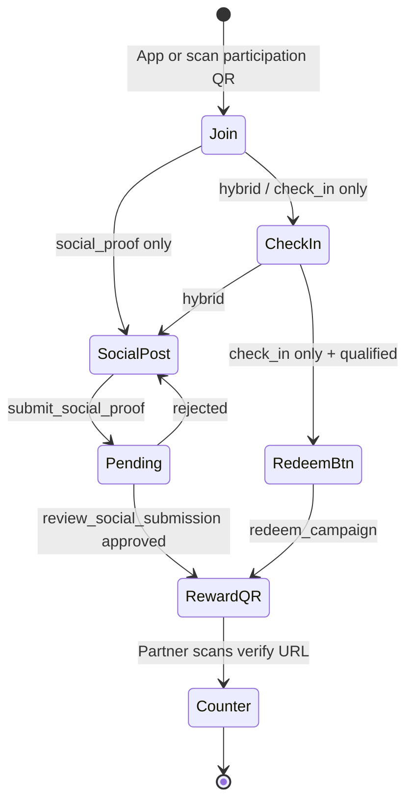

# Plan: EEFFOC Social Flow

**We Give EEFFOC! · QR participation · Social proof · Reward QR**

**Status:** Implemented (Phase A–C)  
**Migration:** `supabase/migrations/20260616120000_eeffoc_social_flow.sql`  
**Related:** [ARCHITECTURE_EXPLORER_ENGAGEMENT.md](./ARCHITECTURE_EXPLORER_ENGAGEMENT.md) · [PROJECT_CONTEXT.md](./PROJECT_CONTEXT.md)

---

## Table of contents

1. [Product goal](#1-product-goal)
2. [Fulfillment modes](#2-fulfillment-modes)
3. [End-to-end flow](#3-end-to-end-flow)
4. [Schema sketches](#4-schema-sketches)
5. [RPC changes](#5-rpc-changes)
6. [UI wireframes & file map](#6-ui-wireframes--file-map)
7. [Verification](#7-verification)
8. [Deferred (Phase D+)](#8-deferred-phase-d)

---

## 1. Product goal

Coffee shops run **EEFFOC campaigns** — limited-time offers (free espresso, matcha, etc.) where explorers:

1. **Join** via app or **participation QR** at the counter
2. **Create a social post** (video/photo) per campaign instructions
3. **Submit proof** (post link or screenshot)
4. **Receive a reward QR** after café approval
5. **Redeem at counter** — partner scans QR or enters backup code

This aligns with CO:FE(X) mission: cafés gain social visibility; explorers get a tangible reward.

**Honest constraint:** Native apps (TikTok, Instagram, Facebook) do not allow third-party post confirmation in v1. We **guide** posting via deep links + caption copy, then **verify** via link/screenshot + partner review.

---

## 2. Fulfillment modes

| Mode | Explorer path | Reward issued by |
|------|---------------|------------------|
| `check_in` | Join → check in → **Redeem** button | `redeem_campaign` |
| `social_proof` | Join → post → submit proof → partner approves | `review_social_submission` |
| `hybrid` | Join → check in → post → approve | `review_social_submission` (after check-in gate) |

Set in **Campaign Wizard** step “Reward & participation” or via template (`social_story` → `social_proof`).

---

## 3. End-to-end flow



### Participation QR URL

```text
https://{app}/campaign/{campaignId}?src=qr&token={participation_token}
```

- Auto-`join_campaign` with `_join_source: 'qr'`
- Analytics: `post_checkin_action` / `campaign_qr_scanned`

### Reward QR payload

```text
https://{app}/partner/verify?code={redemption_code}
```

Partner `verify_redemption_code` RPC marks code used at counter.

---

## 4. Schema sketches

### `campaigns` (extended)

```sql
ALTER TABLE campaigns ADD COLUMN
  fulfillment_mode text NOT NULL DEFAULT 'check_in'
    CHECK (fulfillment_mode IN ('check_in', 'social_proof', 'hybrid')),
  social_requirements jsonb NOT NULL DEFAULT '{}',
  participation_token text UNIQUE;  -- auto-generated on insert
```

**`social_requirements` example:**

```json
{
  "platforms": ["instagram_story", "tiktok", "facebook_post"],
  "caption_template": "Coffee moment at {shop_name}! {hashtag}",
  "media_hints": "Film your drink, the vibe, or your first sip."
}
```

### `social_submissions` (created if missing)

```sql
CREATE TABLE social_submissions (
  id uuid PRIMARY KEY,
  user_id uuid REFERENCES auth.users,
  campaign_id uuid REFERENCES campaigns,
  coffee_shop_id uuid REFERENCES coffee_shops,
  platform text NOT NULL,
  submission_type text CHECK (submission_type IN ('link', 'screenshot')),
  url text,
  screenshot_path text,       -- storage bucket social-proof
  caption text,
  status text DEFAULT 'pending',  -- pending | approved | rejected
  reviewed_by uuid,
  reviewed_at timestamptz,
  review_notes text,
  points_awarded int,
  redemption_code text,
  created_at timestamptz DEFAULT now()
);
```

**Indexes:** one pending submission per user+campaign; campaign status queries.

### `campaign_participants` (extended)

```sql
ALTER TABLE campaign_participants ADD COLUMN joined_source text;  -- 'qr' | 'app' | null
```

---

## 5. RPC changes

| RPC | Change |
|-----|--------|
| `join_campaign(_campaign_id, _join_source?)` | Optional source tracking; fulfillment-aware join notification copy |
| `submit_social_proof(...)` | **New** — validates mode, hybrid check-in gate, inserts pending row |
| `redeem_campaign` | **Blocks** `social_proof`; **hybrid** requires approved social submission |
| `review_social_submission` | **Hybrid** requires check-in before approve; issues redemption + points |
| `get_campaign_by_token(_token)` | **New** — resolve QR token to campaign metadata |

### `submit_social_proof` signature

```sql
submit_social_proof(
  _campaign_id uuid,
  _platform text,
  _submission_type text,  -- 'link' | 'screenshot'
  _url text DEFAULT NULL,
  _screenshot_path text DEFAULT NULL,
  _caption text DEFAULT NULL
) RETURNS jsonb
```

### `redeem_campaign` guard (social_proof)

```sql
IF fulfillment_mode = 'social_proof' THEN
  RAISE EXCEPTION 'Unlock via social post approval';
END IF;
```

---

## 6. UI wireframes & file map

### Partner — participation QR

**File:** `src/routes/_authenticated/partner.campaigns.tsx`  
**Component:** `CampaignParticipationQr.tsx`

```text
┌─────────────────────────────────────────┐
│ PARTICIPATION QR                        │
│ Print at counter · explorers scan       │
│  ┌─────────┐   Link: /campaign/…?src=qr │
│  │ QR CODE │   [Open join page]          │
│  └─────────┘                            │
└─────────────────────────────────────────┘
```

### Explorer — campaign detail (`campaign.$id.tsx`)

```text
┌─────────────────────────────────────────┐
│ [Hero] #WeGiveEEFFOC · Campaign title   │
│ [Joined via QR badge if applicable]     │
├─────────────────────────────────────────┤
│ Mode chip: Social post required         │
│ Reward · Points · Participants · Ends    │
│ Requirements box                      │
├─────────────────────────────────────────┤
│ Your path: 1.Join 2.Post 3.Reward QR    │
│ [Join] / [Check in CTA] / [Waiting…]    │
├─────────────────────────────────────────┤
│ SocialProofSubmit                       │
│ · Suggested caption + Copy + Open TikTok│
│ · Platform chips                        │
│ · Link or screenshot upload             │
│ · Submit proof                          │
├─────────────────────────────────────────┤
│ (after approval)                        │
│ CampaignRewardQr                        │
│ · Reward QR + backup code               │
└─────────────────────────────────────────┘
```

### Explorer — reward QR

**Component:** `CampaignRewardQr.tsx`

```text
┌─────────────────────────────────────────┐
│ 🎁 Your EEFFOC reward is ready!         │
│     Free matcha latte                   │
│         ┌─────────┐                     │
│         │ QR CODE │  → /partner/verify  │
│         └─────────┘                     │
│     Backup: ABC12DEF                    │
│     +25 bonus points                    │
└─────────────────────────────────────────┘
```

### Campaign Wizard — step 2 addition

Three cards: **Check-in at café** | **Social post required** | **Check-in + social post**

### File index

| File | Role |
|------|------|
| `supabase/migrations/20260616120000_eeffoc_social_flow.sql` | Schema + RPCs |
| `src/lib/campaign-fulfillment.ts` | Modes, phases, caption helpers |
| `src/lib/social-share-links.ts` | Platform meta, deep links |
| `src/lib/queries/campaigns.ts` | Detail + social submission state |
| `src/components/app/CampaignQrCode.tsx` | QR renderer (`qrcode`) |
| `src/components/app/CampaignParticipationQr.tsx` | Partner QR card |
| `src/components/app/CampaignRewardQr.tsx` | Explorer reward QR |
| `src/components/app/SocialProofSubmit.tsx` | Composer + proof submit |
| `src/components/app/CampaignWizard.tsx` | Fulfillment mode picker |
| `src/routes/.../campaign.$id.tsx` | Explorer state machine |
| `src/routes/.../partner.campaigns.tsx` | QR display |
| `src/routes/.../partner.verify.tsx` | `?code=` prefill |
| `src/routes/.../partner.submissions.tsx` | Approve/reject (existing) |
| `src/lib/eeffoc-templates.ts` | Template `fulfillment_mode` |

---

## 7. Verification

### Apply migration

```bash
npm run db:push
npm run db:types
```

### Manual smoke

```text
[ ] Partner: create social_proof campaign → Show participation QR
[ ] Explorer: scan QR URL → auto-join + badge
[ ] Explorer: copy caption → open TikTok → submit link
[ ] Partner: approve submission → explorer sees reward QR
[ ] Partner: verify page with ?code= → marks redeemed
[ ] check_in campaign: redeem still works without social step
[ ] hybrid: block social submit before check-in
[ ] social_proof: redeem button hidden; redeem_campaign RPC rejects
```

### Automated

```bash
npm test   # includes campaign-fulfillment.test.ts
npm run build
```

---

## 8. Deferred (Phase D+)

| Item | Notes |
|------|-------|
| Partner camera QR scanner | `partner.verify` — use device camera API |
| Auto-approve rules | URL domain/heuristic match |
| Meta / TikTok official APIs | Partner Business account linking |
| Printable PDF poster | Export participation QR for print |
| Push when submission approved | Notification already inserted; native push later |

---

*Last updated: June 11, 2026*
