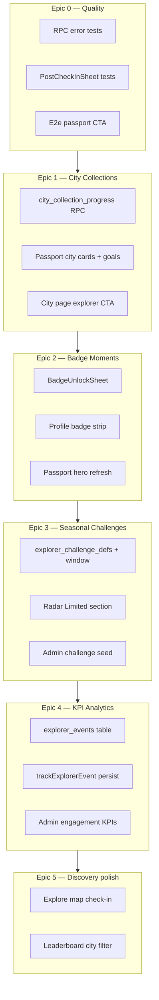

# Plan: Explorer Gaps & Phase 2 Foundations

**City collections · Badge moments · Seasonal challenges · KPI analytics · Quality debt**

**Horizon:** 3 weeks (15 working days)  
**Prerequisite:** [Explorer engagement sprint](./SPRINT_EXPLORER_ENGAGEMENT.md) shipped  
**North star:** [Project context](./PROJECT_CONTEXT.md)

---

## Why this plan exists

The engagement sprint closed the core loop (check-in → sheet → challenges → rank). Against [PROJECT_CONTEXT](./PROJECT_CONTEXT.md), four product gaps and two engineering gaps remain before Phase 3 (City Challenges) can scale with confidence.

| Gap | Pillar(s) | Current state |
|-----|-----------|---------------|
| **City collections depth** | Exploration, Gamification | Passport groups stamps by city; no progress goals, city campaigns, or discovery CTAs |
| **Badge moments** | Gamification, Rewards | Badges unlock on check-in; shown in sheet chips only — underplayed in Passport/Profile |
| **Seasonal challenges** | Gamification, Discovery | Weekly + lifetime only; no limited-time EEFFOC-style explorer challenges |
| **Success metrics** | Partner Growth (indirect) | `explorer-analytics.ts` fires client events; no persistence or admin KPI views |
| **Testing debt** | Engineering | Sprint testing plan partially complete (RPC errors, component test, e2e passport CTA) |
| **Deferred discovery** | Exploration | Explore map check-in, city-scoped leaderboard, push for claimable challenges (sprint out-of-scope) |

Every epic below must pass the [six development questions](./PROJECT_CONTEXT.md#development-principles).

---

## Sprint outcomes

| Outcome | Success signal (4 weeks post-ship) |
|---------|-------------------------------------|
| City exploration feels collectible | ≥20% of MAE open Passport city section weekly |
| Badges feel like achievements | ≥30% of new badge unlocks viewed in Passport within 7 days |
| Limited challenges drive urgency | ≥25% claim rate on active seasonal challenge before `ends_at` |
| Product decisions are data-informed | Admin engagement dashboard shows explorer funnel KPIs |
| Regressions caught early | CI runs unit + integration + smoke e2e on PR |

---

## Architecture overview



---

## Epic 0: Quality & testing debt (Days 1–2)

**Goal:** Close the [sprint testing plan](./SPRINT_EXPLORER_ENGAGEMENT.md#testing-plan) before new features land.

### 0.1 RPC integration — error paths

| Test | Mock RPC response | Assert |
|------|-------------------|--------|
| Incomplete challenge | `Challenge not complete (3 / 5)` | `parseRpcErrorMessage` surfaces progress |
| Already claimed | `Already claimed` | Mutation shows friendly toast |

**Files:** `src/lib/rpc/client.integration.test.ts`

### 0.2 PostCheckInSheet logic tests

Extract pure helpers (no RTL required):

- `getPostCheckInActions({ campaigns, claimableChallenge })` → ordered action list
- Test: campaign row hidden when `campaigns=[]`
- Test: claimable row first when `claimableChallenge` set

**Files:** `src/lib/post-check-in-actions.ts` (new), `post-check-in-actions.test.ts`

### 0.3 E2e smoke extension

| Flow | Steps |
|------|-------|
| Rewards → Rank | Already covered |
| Check-in → passport | Open sheet → tap “View passport stamp” → `/passport` loads |

**Files:** `e2e/authenticated.spec.ts`

### 0.4 Acceptance criteria

- [ ] All vitest suites green; +3 RPC tests, +4 action helper tests
- [ ] E2e passport CTA passes with `E2E_SHOP_SLUG` env
- [ ] CI workflow runs `npm test` + `npm run test:e2e` (smoke subset)

---

## Epic 1: City collections depth (Days 3–6)

**Goal:** Turn passport city stamps into a **Pokémon Go–style collection** loop — progress, goals, and discovery — not just a grouped list.

**Pillars:** Exploration, Gamification, Discovery

### 1.1 Problem

- `passport.tsx` shows city groups and stamp count but no **collection completion** narrative
- `cities_explored` challenge on Radar is disconnected from Passport city UI
- `/city/$city` exists for SEO but explorers lack a **“your progress in this city”** card

### 1.2 Data model

```sql
-- Optional: materialized progress per user/city (or compute in RPC)
CREATE TABLE public.city_collection_milestones (
  city_slug text PRIMARY KEY,
  city_name text NOT NULL,
  country text,
  shops_target int NOT NULL DEFAULT 5,  -- "collection complete" threshold
  badge_slug text REFERENCES badges(slug), -- reward badge on complete
  sort_order int DEFAULT 0
);

CREATE OR REPLACE FUNCTION public.get_city_collection_progress(_city_slug text)
RETURNS jsonb -- { city, visited, target, pct, stamps[], next_shop_suggestion }
```

Seed milestones for launch cities (Lisbon, Munich, Berlin, …) aligned with existing city badges (`munich-explorer`, `berlin-explorer`).

### 1.3 Explorer UI

| Surface | Change |
|---------|--------|
| **Passport** | City cards show progress ring (`4/5 cafés`), “Complete collection” CTA, link to `/city/$slug` |
| **City page** | Logged-in explorers see `CityCollectionCard` — your stamps here, suggested next café |
| **Radar** | When `cities_explored` challenge in progress, link “View city collections →” to Passport filtered |
| **Post-check-in** | If check-in advances a city toward completion, sheet row: “Almost done in {city}!” |

### 1.4 Files

```
supabase/migrations/YYYYMMDD_city_collections.sql
src/lib/queries/city-collections.ts
src/components/app/CityCollectionCard.tsx
src/routes/_authenticated/_explorer/passport.tsx
src/routes/city.$city.tsx
```

### 1.5 Acceptance criteria

- [ ] At least 3 seeded cities with milestones
- [ ] Passport city card shows `visited / target` and progress bar
- [ ] City page shows explorer progress when authenticated
- [ ] Completing a city milestone awards linked badge (if configured)
- [ ] Mobile-first; empty/error states per [DEVELOPMENT_PLAN](./DEVELOPMENT_PLAN.md)

---

## Epic 2: Badge moments (Days 7–9)

**Goal:** Badges should feel like **Duolingo achievements**, not database rows.

**Pillars:** Gamification, Rewards

### 2.1 Problem

- `perform_check_in` returns `new_badges` → small chips in `PostCheckInSheet` only
- Passport has a badge grid but no **celebration** on first visit after unlock
- Profile has no badge visibility

### 2.2 UX design

**BadgeUnlockSheet** (bottom sheet, sibling to post-check-in):

- Trigger when `new_badges.length > 0` after check-in (stack after or merge into post-check-in flow)
- Large Lucide icon, badge name, criteria copy, “View in passport” CTA
- Subtle confetti / gold ring (match challenge claim celebration on Radar)

**Profile** — horizontal earned-badge strip (last 5 + “+N” → Passport)

**Passport** — move earned badges above stamp grid; “Recently unlocked” row at top

### 2.3 Analytics

Track `badge_unlocked` with `{ slug, source: 'check_in' | 'city_milestone' | 'challenge' }`.

### 2.4 Files

```
src/components/app/BadgeUnlockSheet.tsx
src/components/app/CoffeeShopPage.tsx
src/routes/_authenticated/_explorer/profile.tsx
src/routes/_authenticated/_explorer/passport.tsx
src/lib/explorer-analytics.ts (+ badge_unlocked event)
```

### 2.5 Acceptance criteria

- [ ] New badge from check-in shows dedicated unlock moment (not only inline chip)
- [ ] Profile shows earned badge strip
- [ ] Passport highlights recent unlocks
- [ ] No badge spam on re-check-in same day (server already dedupes)

---

## Epic 3: Seasonal & limited challenges (Days 10–12)

**Goal:** EEFFOC-style **limited-time** explorer challenges that create urgency.

**Pillars:** Gamification, Discovery, Rewards

### 3.1 Problem

`explorer_challenge_defs` has `weekly` | `lifetime` periods only. [PROJECT_CONTEXT](./PROJECT_CONTEXT.md) calls for **Seasonal Challenges** and campaigns that “feel limited and exciting.”

### 3.2 Schema extension

```sql
ALTER TABLE public.explorer_challenge_defs
  ADD COLUMN starts_at timestamptz,
  ADD COLUMN ends_at timestamptz,
  ADD COLUMN campaign_tag text; -- e.g. 'matcha-week-2026'

-- period_type check extended: 'weekly' | 'lifetime' | 'limited'
```

RPC `claim_explorer_challenge`:

- Reject if `now() < starts_at` or `now() > ends_at` for `limited` type
- `period_key` = `campaign_tag` or `limited:YYYY-MM-DD`

Seed example:

| id | title | window | reward |
|----|-------|--------|--------|
| `matcha-week` | Matcha Week | 7 days | 80 pts |
| `espresso-friday` | Espresso Friday | 1 day | 30 pts |

### 3.3 UI

| Surface | Change |
|---------|--------|
| **Radar** | “Limited time” section above weekly challenges; countdown (`2d left`) |
| **Post-check-in** | Surface active limited challenge if one check-in away |
| **Admin** | Simple form or SQL seed doc to schedule challenges |

### 3.4 Files

```
supabase/migrations/YYYYMMDD_seasonal_challenges.sql
src/lib/explorer-challenges.ts (+ limited period, countdown helpers)
src/routes/_authenticated/_explorer/radar.tsx
```

### 3.5 Acceptance criteria

- [ ] At least one seeded limited challenge visible on Radar during window
- [ ] Claim blocked outside window (server + friendly error)
- [ ] Countdown copy on card; card hidden after `ends_at`
- [ ] `weeklyResetLabel` pattern extended to `limitedCountdownLabel()`

---

## Epic 4: Engagement analytics & KPIs (Days 13–14)

**Goal:** Measure [primary KPIs](./PROJECT_CONTEXT.md#success-metrics) and [engagement sprint targets](./SPRINT_EXPLORER_ENGAGEMENT.md#success-metrics-2-weeks-post-ship).

**Pillars:** All (instrumentation)

### 4.1 Problem

`trackExplorerEvent` only `console.debug` + `CustomEvent` — no persistence, no funnel math.

### 4.2 Data model

```sql
CREATE TABLE public.explorer_events (
  id uuid PRIMARY KEY DEFAULT gen_random_uuid(),
  user_id uuid REFERENCES auth.users(id) ON DELETE SET NULL,
  event_name text NOT NULL,
  props jsonb DEFAULT '{}',
  created_at timestamptz DEFAULT now()
);

CREATE INDEX explorer_events_name_created ON public.explorer_events (event_name, created_at DESC);

-- RLS: users insert own; admins read all
```

Optional RPC `log_explorer_event(_name, _props)` for batched client flush (rate-limited).

### 4.3 KPI definitions (admin dashboard)

| KPI | Query concept |
|-----|---------------|
| Leaderboard DAU / MAE | `leaderboard_opened` / distinct DAU |
| Challenge claim rate | claims / users with `complete` stat |
| Post-check-in action rate | `post_checkin_action` / `post_checkin_sheet_opened` |
| Check-in → review | reviews within 24h of check-in / check-ins |
| Campaign participation | existing `get_admin_engagement` extension |

### 4.4 Client changes

- `trackExplorerEvent` → debounced `log_explorer_event` RPC (fail silent)
- Extend events: `badge_unlocked`, `city_collection_viewed`, `seasonal_challenge_viewed`

### 4.5 Files

```
supabase/migrations/YYYYMMDD_explorer_events.sql
src/lib/explorer-analytics.ts
src/routes/_authenticated/admin.analytics.tsx (or extend admin engagement)
src/lib/queries/admin-engagement.ts
```

### 4.6 Acceptance criteria

- [ ] Core explorer events persisted in production
- [ ] Admin page shows 4 engagement sprint metrics (7d / 30d toggle)
- [ ] No PII in `props` beyond slugs/ids
- [ ] DEV still logs to console when RPC unavailable

---

## Epic 5: Discovery polish (Days 15+ / stretch)

**Goal:** Address [sprint out-of-scope](./SPRINT_EXPLORER_ENGAGEMENT.md#out-of-scope-next-sprint) items that highest-impact for exploration.

**Priority order within epic:**

### 5.1 Explore map check-in

- Shop preview sheet on marker tap → “Check in here” (reuse `CheckInButton` / geo flow)
- **Pillars:** Exploration — reduces friction vs navigating to shop page

### 5.2 City-scoped leaderboard

- Extend `get_leaderboard` or add filter `_city_slug`
- Rank menu or leaderboard chip: Global | This city
- **Pillars:** Community, Gamification

### 5.3 Claimable challenge nudge (web)

- In-app banner on Radar when claim pending (push notifications = Phase 2+; web first)
- **Pillars:** Gamification, Rewards

### 5.4 Deferred (Phase 3+)

- Friends leaderboard
- Realtime leaderboard (Supabase Realtime)
- Partner mobile verify flow
- Push notifications (native / PWA)

### 5.5 Acceptance criteria (stretch)

- [ ] Check-in from explore map works within 200 m
- [ ] Leaderboard city filter for ≥1 launch city
- [ ] Radar shows dismissible “You have rewards to claim” when `claimable` exists

---

## Recommended sequencing

| Week | Focus | Shippable slice |
|------|-------|-----------------|
| **1** | Epic 0 + Epic 1 start | Tests green; passport city progress cards |
| **2** | Epic 1 finish + Epic 2 | City milestones live; badge unlock sheet |
| **3** | Epic 3 + Epic 4 | Matcha Week challenge; admin KPI tiles |
| **4+** | Epic 5 stretch | Map check-in, city leaderboard |

Build order matches dependency chain: **quality → collections → badges → seasonal → metrics → discovery**.

---

## Shared infrastructure

| Item | Purpose |
|------|---------|
| `src/lib/post-check-in-actions.ts` | Testable action ordering |
| `src/lib/city-collections.ts` | Milestone defs + progress helpers |
| `explorer_challenge_defs.starts_at/ends_at` | Limited challenges |
| `explorer_events` table | KPI source of truth |
| `BadgeUnlockSheet` | Reusable achievement moment |

Invalidate on city check-in: `passport`, `challengeClaims`, `cityCollection`, `profile`.

---

## Testing plan

| Layer | Coverage |
|-------|----------|
| **Unit** | `post-check-in-actions`, `limitedCountdownLabel`, city progress helpers |
| **RPC integration** | `claim_explorer_challenge` incomplete/claimed/limited-expired |
| **Component** | `BadgeUnlockSheet` renders badge list |
| **E2e** | Check-in → badge sheet OR passport CTA; Rewards → Rank |
| **Admin** | KPI cards render with seed events |

---

## Out of scope (this plan)

- CO:FE(X) token / crypto
- Food delivery, ordering, reservations
- Full push notification infrastructure
- European expansion tooling
- Premium membership billing

---

## Deliverables checklist

- [x] Epic 0: Testing debt closed + CI
- [x] Epic 1: City collection milestones + UI
- [x] Epic 2: Badge unlock moments + profile strip
- [x] Epic 3: Limited-time challenges on Radar
- [x] Epic 4: `explorer_events` + admin KPI dashboard
- [x] Epic 5 (stretch): Explore map check-in + city leaderboard filter

---

## Related docs

- [Project context](./PROJECT_CONTEXT.md)
- [Explorer engagement sprint](./SPRINT_EXPLORER_ENGAGEMENT.md) — completed baseline
- [Development plan](./DEVELOPMENT_PLAN.md) — engineering DoD
- [Architecture](./ARCHITECTURE.md)
