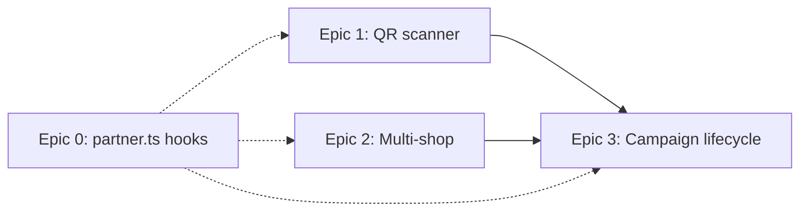
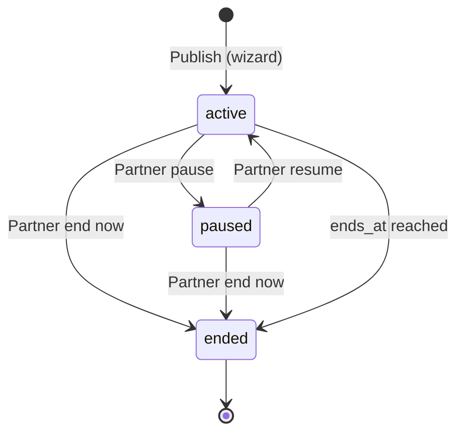

# Plan: Partner Next Steps

**Verify QR scanner · Multi-shop management · Campaign edit & lifecycle**

> **Status: ✅ Implemented (June 11, 2026)** — See [LATEST_CHANGES.md](./LATEST_CHANGES.md) for ship details and [memory-bank/progress.md](./memory-bank/progress.md).

**Horizon:** 2 weeks (10 working days)  
**Prerequisite:** Partner UI refresh (AppPage shell, 8 functional routes)  
**Related:** [PLAN_EEFFOC_SOCIAL_FLOW.md](./PLAN_EEFFOC_SOCIAL_FLOW.md) · [ARCHITECTURE.md](./ARCHITECTURE.md) · [DEVELOPMENT_PLAN.md](./DEVELOPMENT_PLAN.md)

---

## Why this plan exists

Partner MVP covers the full EEFFOC loop (shop → campaign → submissions → verify → analytics → billing), but three friction points remain for daily counter use and multi-location brands:

| Gap | Impact | Current state |
|-----|--------|---------------|
| **Manual code entry only** | Slow at busy counters; error-prone | `partner.verify` accepts typed code + `?code=` URL prefill |
| **Single-shop shop profile** | Pro partners cannot manage multiple listings | Rewards/analytics support shop pickers; shop page loads `.limit(1)` |
| **Create/delete only campaigns** | Partners cannot pause or fix typos mid-run | Admin has `admin_set_campaign_status`; partners delete or live with mistakes |

Deferred items from [PLAN_EEFFOC Phase D+](./PLAN_EEFFOC_SOCIAL_FLOW.md#8-deferred-phase-d) are prioritized here where they unblock real café operations.

---

## Sprint outcomes

| Outcome | Success signal (4 weeks post-ship) |
|---------|-------------------------------------|
| Faster counter redemption | ≥50% of partner verifications use scan (vs manual) on mobile |
| Pro multi-location works | Partners with 2+ shops can switch/edit each listing without support |
| Safer campaign control | Pause/end available; zero orphaned redemptions after pause |
| Engineering hygiene | Partner data hooks live in `lib/queries/partner.ts` (no new raw `useEffect` pages) |

---

## Recommended order



| Priority | Epic | Effort | Rationale |
|----------|------|--------|-----------|
| **P0** | Epic 0 — Shared partner queries | 1 day | Reduces duplication before touching 3 routes |
| **P1** | Epic 1 — Verify QR scanner | 2–3 days | Highest daily UX win; no schema change |
| **P2** | Epic 2 — Multi-shop shop profile | 2–3 days | Unblocks Pro value prop |
| **P3** | Epic 3 — Campaign edit / pause / end | 3–4 days | Needs RPC + careful edit rules |

---

## Epic 0 — Shared partner queries (foundation)

**Goal:** Centralize partner Supabase access in React Query hooks (per `DEVELOPMENT_PLAN.md`).

### New file: `src/lib/queries/partner.ts`

| Hook | Used by |
|------|---------|
| `usePartnerShops(userId)` | Shop, campaigns wizard, rewards, dashboard |
| `usePartnerCampaigns(shopIds)` | Campaigns, analytics |
| `usePartnerSubmissions(status)` | Submissions |
| `usePartnerVerifyAudit()` | Verify |
| `useVerifyRedemptionCode()` | Verify (mutation) |

### Query keys

Extend `src/lib/queries/keys.ts` with `partnerShops`, `partnerCampaigns`, `partnerSubmissions`, `partnerVerifyAudit`.

### Migration path

Refactor one page at a time (Verify first — smallest surface). Do **not** block Epics 1–3 on full migration; migrate touched files only.

---

## Epic 1 — Camera QR scanner on Verify

**Goal:** Partner scans explorer reward QR at counter; code auto-fills and verifies.

### Context (already implemented)

- Explorer reward QR payload: `/partner/verify?code={redemption_code}` (`campaignVerifyUrl` in `src/lib/campaign-fulfillment.ts`)
- Backup: 8-character monospace code on `CampaignRewardQr`
- RPC: `verify_redemption_code` (rate limit 60/hr, audit in `redemption_verifications`)
- Manual entry + `?code=` prefill already work in `partner.verify.tsx`

### UX design

```
┌─────────────────────────────────────┐
│  Verify redemption code             │
├─────────────────────────────────────┤
│  [ Scan QR ]  [ Enter code ]        │  ← tabs or toggle
│  ┌─────────────────────────────┐    │
│  │   live camera viewfinder    │    │
│  │   (mobile: rear camera)     │    │
│  └─────────────────────────────┘    │
│  Point at explorer's reward QR      │
│  ─── or enter code manually ───     │
└─────────────────────────────────────┘
```

- Default to **Scan** on mobile (`md:` breakpoint), **Enter** on desktop (camera optional).
- On successful decode → extract `code` query param or treat raw string as code if 4–16 alphanumeric.
- Auto-call `verify_redemption_code`; show existing result panel.
- Haptic/toast on success; keep camera open for next customer (with 2s cooldown to prevent double-scan).

### Technical approach

| Option | Pros | Cons | Recommendation |
|--------|------|------|----------------|
| **`html5-qrcode`** | Mature, works on iOS Safari | +~40kb gzip | **Preferred** |
| `@zxing/browser` | Lightweight | More integration work | Fallback |
| `BarcodeDetector` API | Zero deps | Safari gaps | Progressive enhancement only |

**Dependency:** add `html5-qrcode` (scan only; keep existing `qrcode` for generation).

### New components

| File | Responsibility |
|------|----------------|
| `src/components/app/partner/VerifyQrScanner.tsx` | Camera lifecycle, permissions, decode callback |
| `src/lib/parse-verify-code.ts` | Parse URL or raw code; unit tests |

```typescript
// parse-verify-code.ts behavior
// "https://app/partner/verify?code=ABC12345" → "ABC12345"
// "ABC12345" → "ABC12345"
// invalid → null
```

### Permissions & errors

- `NotAllowedError` → inline CTA: “Enable camera in browser settings” + fall back to manual.
- `NotFoundError` → no camera hardware message.
- HTTPS required (already true in prod).

### Security

- No change to RPC; scanner only replaces keyboard input.
- Do not log full URLs in analytics (code only).

### Tests

| Type | Cases |
|------|-------|
| Unit | `parseVerifyCode` URL, raw code, malformed |
| Manual | iOS Safari, Android Chrome, desktop webcam |
| E2e (optional) | Mock scanner callback → verify success panel |

### Acceptance criteria

- [ ] Scan decodes reward QR URL and verifies without typing
- [ ] Manual entry still works; `?code=` deep link unchanged
- [ ] Camera permission denied shows friendly fallback
- [ ] Audit log updates after scan-triggered verify

---

## Epic 2 — Multi-shop switching on Shop profile

**Goal:** Pro partners manage all café listings from one shop profile screen.

### Context (already implemented)

- `PLAN_LIMITS.pro.maxShops = null` (unlimited)
- `canAddShop` in `billingLimitsForShop` / `partner.shop.tsx` gates second shop
- `CampaignWizard` already lists all shops when >1
- `partner.rewards.tsx` has shop dropdown
- Shop page loads **first shop only**: `.limit(1).maybeSingle()`

### UX design

```
Shop profile
┌──────────────────────────────────────────┐
│ Location: [ Downtown ▾ ]  [ + Add shop ] │
├──────────────────────────────────────────┤
│ (existing cover, basics, GPS, gallery)   │
└──────────────────────────────────────────┘
```

- **Shop switcher** in `AppPageHeader` action slot (Select or combobox).
- **Add shop** button when `canAddShop`; duplicates create flow with empty form.
- Persist last selected shop in `localStorage` (`partner-active-shop-id`).
- Show per-shop status pill (pending / active).
- Link “View on map” when slug + active.

### Data changes

**None required** if using existing `coffee_shops` RLS (partner owns rows).

Optional enhancement (later):

- `shop_subscriptions` row auto-created on insert (verify trigger exists in monetization migration).

### Scope across partner app

| Page | Change |
|------|--------|
| `partner.shop.tsx` | Full multi-shop (this epic) |
| `partner.index.tsx` | KPI filter: all shops vs selected (stretch) |
| `CampaignWizard` | Already multi-shop |
| `partner.rewards.tsx` | Share shop switcher component |
| `partner.analytics.tsx` | Optional shop filter chip row |

### New shared component

`src/components/app/partner/PartnerShopSelect.tsx` — used by shop, rewards, wizard, analytics.

### Edge cases

| Case | Behavior |
|------|----------|
| Free plan, 1 shop | Hide switcher; hide Add shop |
| Delete shop | Not in v1 (admin only); document |
| Pending shop | Show badge; explain moderation |
| Missing GPS on any shop | Dashboard warning chip |

### Tests

- Unit: shop switcher reads/writes localStorage
- Integration: Pro user with 2 shops can save different names per shop
- Billing gate: free user sees toast on Add shop #2

### Acceptance criteria

- [ ] Partner with N shops can switch and edit each independently
- [ ] Add shop respects plan limits
- [ ] GPS fields per shop (already added in UI refresh)
- [ ] Selection persists across sessions

---

## Epic 3 — Campaign edit, pause, and end

**Goal:** Partners fix campaign copy, pause fulfillment, or end drops without deleting history.

### Context (already implemented)

- Campaign statuses in DB: `draft`, `active`, `paused`, `ended`, `rejected`
- `join_campaign`, `submit_social_proof`, `redeem_campaign` require `status = 'active'`
- Admin uses `admin_set_campaign_status` RPC
- Partner RLS allows direct `UPDATE` on own campaigns — but **no UI** and **no field-level rules**
- Plan limit trigger fires on `INSERT OR UPDATE OF status` (`enforce_campaign_plan_limit_trg`)
- Delete is destructive (participants/redemptions cascade concerns)

### Lifecycle model



**Not in v1:** `draft` editor, `rejected` (admin-only).

### New RPC: `partner_set_campaign_status`

```sql
partner_set_campaign_status(_campaign_id uuid, _status text)
-- Validates: auth partner owns shop; _status IN ('active','paused','ended')
-- ended: optionally SET ends_at = now()
-- Re-activating checks plan active campaign limit
-- Returns { campaign_id, status, ends_at }
```

Why RPC instead of raw update:

- Centralize plan limit check on resume
- Audit trail hook (optional `partner_campaign_events` table later)
- Mirror admin pattern

### New RPC: `partner_update_campaign`

Restricted update for partners:

```sql
partner_update_campaign(
  _campaign_id uuid,
  _patch jsonb  -- allowed keys only
)
```

**Editable when `active` and participants = 0:**

- All wizard fields including `fulfillment_mode`, `max_participants`, `ends_at`, `social_requirements`

**Editable when `active` and participants > 0:**

| Field | Rule |
|-------|------|
| `title`, `description`, `reward_description`, `requirements`, `hashtag` | Always OK |
| `max_participants` | Increase only |
| `ends_at` | Extend only (≥ now) |
| `points_reward` | Increase only (optional policy) |
| `fulfillment_mode` | **Blocked** |
| `coffee_shop_id` | **Blocked** |

**Editable when `paused`:** same as active with participants > 0, plus allow `ends_at` shorten to now (end).

### UI changes

| Surface | Change |
|---------|--------|
| `partner.campaigns.tsx` | Actions menu: Edit · Pause · End (not Delete as primary) |
| `CampaignWizard.tsx` | Add `mode: 'create' \| 'edit'`, `campaignId` prop; load existing row |
| Campaign card | Show `paused` status pill; disable participation QR when paused |
| Confirm dialogs | End campaign: “Explorers can’t join; existing rewards still valid at counter” |

### Explorer impact

- Paused/ended campaigns hidden from explorer lists (verify `campaigns` RLS select: explorers only see `active`).
- Existing redemption codes remain verifiable (`verify_redemption_code` should not require campaign active — **verify current RPC**).

### Notifications (optional stretch)

- Insert partner notification when campaign auto-ends (`ends_at`).

### Tests

| Type | Cases |
|------|-------|
| SQL / integration | pause blocks join; resume respects plan limit; edit blocked fields rejected |
| Unit | `getEditableCampaignFields(participantCount, status)` |
| E2e | Partner pauses → explorer cannot join |

### Acceptance criteria

- [ ] Partner can pause and resume active campaign
- [ ] Partner can end campaign immediately
- [ ] Partner can edit copy on live campaign
- [ ] Fulfillment mode locked after first participant
- [ ] Delete demoted to advanced/confirm destructive action
- [ ] Existing verify codes still work after pause/end

---

## Cross-cutting work

### Documentation

- Update `PLAN_EEFFOC_SOCIAL_FLOW.md` §8 — move scanner to implemented when done
- Add partner section to `LATEST_CHANGES.md`

### Analytics events (optional)

| Event | When |
|-------|------|
| `partner_verify_scan_success` | QR decode + verify ok |
| `partner_verify_scan_failed` | Decode fail |
| `partner_campaign_paused` | status → paused |
| `partner_shop_switched` | shop select change |

Use existing `explorer_events` pattern or partner-specific table if KPI dashboard needs it.

### Out of scope (later phases)

| Item | Notes |
|------|-------|
| Printable participation QR PDF | EEFFOC Phase D+ |
| Auto-approve social submissions | Fraud risk |
| Campaign duplicate / template from existing | Nice-to-have |
| Shop delete / archive | Needs admin workflow |
| `partner_mark_catalog_code_used` UI | Wallet catalog verify at counter |
| API keys & webhooks settings | ARCHITECTURE.md |
| Native push on submission approved | Notifications table exists |

---

## Test plan (sprint)

```bash
npm test          # parse-verify-code, campaign edit rules
npm run build
npm run test:e2e:partner  # 12 tests: setup + guest + all partner routes
```

Manual QA checklist:

1. Scan reward QR on phone → verify success → audit row
2. Switch between 2 shops → save different cover images
3. Pause campaign → explorer join fails → resume works
4. Edit hashtag on live campaign with participants → saves
5. Try change fulfillment mode with participants → blocked with message

---

## File index (expected touch)

| Area | Files |
|------|-------|
| QR scanner | `VerifyQrScanner.tsx`, `parse-verify-code.ts`, `partner.verify.tsx` |
| Multi-shop | `PartnerShopSelect.tsx`, `partner.shop.tsx`, `usePartnerShops` |
| Campaign lifecycle | migration `partner_campaign_lifecycle.sql`, `CampaignWizard.tsx`, `partner.campaigns.tsx` |
| Queries | `lib/queries/partner.ts`, `keys.ts` |

---

## Timeline (2-week sprint)

| Day | Focus |
|-----|-------|
| 1 | Epic 0 hooks + `parse-verify-code` tests |
| 2–3 | Epic 1 QR scanner component + Verify page integration |
| 4–5 | Epic 2 shop switcher + add shop flow |
| 6–7 | Epic 3 migration RPCs + integration tests |
| 8–9 | Epic 3 CampaignWizard edit mode + pause/end UI |
| 10 | QA, docs, e2e smoke, polish |

---

*Last updated: June 11, 2026*
