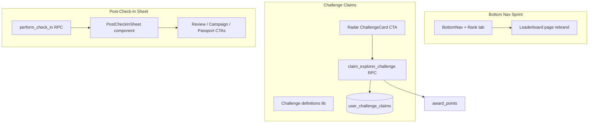

# Sprint Plan: Explorer Engagement

**Leaderboard in nav · Challenge claims · Post-check-in sheet**

**Duration:** 2 weeks (10 working days)  
**Goal:** Turn passive UI into actionable engagement loops after every check-in and weekly visit to Radar.

**Architecture reference (comprehensive):** [ARCHITECTURE_EXPLORER_ENGAGEMENT.md](./ARCHITECTURE_EXPLORER_ENGAGEMENT.md) — process flows, data models, RPC contracts, sequence diagrams, file index.

---

## Sprint outcomes

| Outcome | Success signal |
|---------|----------------|
| Leaderboard is discoverable | ≥30% of weekly active explorers open `/leaderboard` from nav |
| Challenges reward real points | Claim flow works end-to-end; ledger shows `challenge_reward` entries |
| Check-in feels like a moment | Post-check-in sheet shown on every successful check-in with ≥1 follow-up action taken |

---

## Current state (post-sprint)

| Feature | Status | Key files |
|---------|--------|-----------|
| Leaderboard page | In nav as **Rank** tab; React Query + cofex styling | `leaderboard.tsx`, `get_leaderboard`, `get_my_leaderboard_rank` |
| Radar challenges | Claimable with DB-backed defs + celebration UI | `radar.tsx`, `explorer_challenge_defs`, `claim_explorer_challenge` |
| Check-in success | Bottom sheet with guided CTAs + claimable challenge row | `PostCheckInSheet.tsx`, `CoffeeShopPage.tsx` |
| Points system | `award_points`, `points_ledger`, `challenge_reward` | RPCs + wallet ledger |
| Nav | 5 slots: Radar, Explore, Campaigns, Rewards↓ (Passport · Crawls · Rank · Wallet), Profile | `BottomNav.tsx` |
| Profile rank card | Shortcut to leaderboard with live rank | `profile.tsx`, `useMyLeaderboardRank` |
| Analytics hooks | Custom events for leaderboard, claims, post-check-in | `explorer-analytics.ts` |

---

## Architecture overview



---

## Epic 1: Leaderboard in navigation

### 1.1 Navigation strategy

**Recommended:** Rank lives in the **Rewards** menu with Passport and Wallet (not a standalone tab).

| Option | Pros | Cons |
|--------|------|------|
| **A. Rewards dropdown item** (current) | Less nav crowding; groups explorer rewards | Slightly lower discoverability than a dedicated tab |
| B. New Rank tab | High discoverability | 6 nav items — tight on small phones |
| C. Profile entry only | No nav change | Easy to miss |

**Nav order:** Radar → Explore → Campaigns → **Rewards↓** (Passport · Rank · Wallet) → Profile

### 1.2 Leaderboard page polish

Align with explorer design system (same sprint, same PR stack):

| Task | Detail |
|------|--------|
| React Query migration | `useLeaderboard(metric)` in `src/lib/queries/leaderboard.ts`; replace raw `useEffect` fetch |
| Level icons | Replace emoji levels with Lucide — shared `src/lib/explorer-levels.ts` |
| Tokens | Replace `zinc-*` with `cofex-*` tokens |
| Metric chips | Use `cofex-app-chip` / `cofex-app-chip-active` for metric tabs |
| Podium + list | Wrap in `cofex-app-card` |
| Personal rank card | Pin “Your rank” card at top when user is outside top 50 |
| Deep links | Tap explorer row → future profile (v2); v1: show city + points only |

### 1.3 Secondary entry points (same sprint, low effort)

- **Radar:** “See full leaderboard →” link in Explorer Challenges section footer
- **Profile:** Small stat card “Rank #12 in Lisbon” linking to `/leaderboard` (if RPC returns city scope later; v1 global only)

### 1.4 Files to touch

```
src/components/app/BottomNav.tsx
src/routes/_authenticated/_explorer/leaderboard.tsx
src/lib/queries/leaderboard.ts          (new)
src/lib/queries/keys.ts                 (+ leaderboard key)
src/lib/explorer-levels.ts              (new, shared with profile)
```

### 1.5 Acceptance criteria

- [x] `/leaderboard` reachable in **2 taps** from bottom nav (Rewards → Rank)
- [x] Active state highlights Rewards nav when on leaderboard (shows Rank icon + label)
- [x] All 5 metrics load via React Query with loading/error states
- [x] Visual parity with Passport/Wallet (cards, chips, Lucide, no emoji levels)
- [x] Build passes; e2e smoke: nav → leaderboard renders podium
- [x] “Your rank” card when user is outside top 50 (`get_my_leaderboard_rank`)
- [x] Profile rank shortcut card

---

## Epic 2: Challenge claims (Radar)

### 2.1 Problem

Challenges in `radar.tsx` are computed from `get_coffee_radar` stats but:

- No **Claim** button
- No **server-side verification**
- No **idempotency** (could spam points if client-only)
- `cities` and `streak` are **lifetime** milestones; `weekly` / `new3` are **weekly**

### 2.2 Challenge catalog (source of truth)

Create `src/lib/explorer-challenges.ts`:

| ID | Title | Rule | Target | Reward | Period |
|----|-------|------|--------|--------|--------|
| `weekly` | Weekly Wanderer | `visits_this_week` | 5 | 50 pts | ISO week |
| `new3` | Three New Doors | `new_shops_this_week` | 3 | 75 pts | ISO week |
| `streak` | On Fire | `streak_days` | 5 | 100 pts | `once` |
| `cities` | City Hopper | `cities_explored` | 3 | 150 pts | `once` |

### 2.3 Database migration

```sql
CREATE TABLE public.user_challenge_claims (
  id uuid PRIMARY KEY DEFAULT gen_random_uuid(),
  user_id uuid NOT NULL REFERENCES auth.users(id) ON DELETE CASCADE,
  challenge_id text NOT NULL,
  period_key text NOT NULL,
  points_awarded int NOT NULL,
  claimed_at timestamptz NOT NULL DEFAULT now(),
  UNIQUE (user_id, challenge_id, period_key)
);
```

### 2.4 RPC: `claim_explorer_challenge`

Server logic:

1. Authenticate user
2. Load challenge definition
3. Recompute progress from DB (same queries as `get_coffee_radar` stats)
4. If `progress < target` → raise exception `Challenge not complete`
5. Derive `period_key` (ISO week or `'lifetime'`)
6. If claim exists → raise `Already claimed`
7. `PERFORM award_points(_user, _reward, 'challenge_reward', ...)`
8. Insert `user_challenge_claims`
9. Return `{ challenge_id, points_awarded, total_points, period_key }`

### 2.5 UI: ChallengeCard states

| State | UI |
|-------|-----|
| In progress | Progress bar |
| **Claimable** | Green ring + **Claim +50 pts** button |
| Claimed | “Claimed ✓” badge + muted card |

### 2.6 Acceptance criteria

- [x] Complete challenge → **Claim** appears (not before)
- [x] Claim credits wallet; ledger entry `challenge_reward`
- [x] Second claim same period blocked server-side
- [x] Radar refreshes after claim and after check-in
- [x] Weekly reset copy on challenge cards
- [x] Claim celebration overlay beyond toast
- [x] Challenge rules in `explorer_challenge_defs` (RPC source of truth)

---

## Epic 3: Post-check-in sheet

### 3.1 UX design: bottom sheet

Use Radix **Sheet** (`side="bottom"`) — mobile-native.

**Action rows (priority order):**

| Action | Condition | Destination |
|--------|-----------|-------------|
| **Write a review** | Always | Scroll to `#reviews` on same page |
| **Join campaign** | Active campaigns exist | `/campaign/$id` |
| **View passport** | Always | `/passport` |
| **Explore more** | Always (secondary) | `/explore` |

### 3.2 Acceptance criteria

- [x] Successful check-in opens sheet automatically
- [x] Sheet shows points, total, badges with branded styling
- [x] ≥3 action rows rendered with correct conditional logic
- [x] Review CTA scrolls to review section
- [x] Campaign CTA only shows when campaigns exist
- [x] Dismissing sheet leaves user on shop page with check-in persisted
- [x] Claimable challenge row when a challenge is ready

---

## Sprint sequencing

**Recommended build order:**

1. **Day 1–2:** DB + RPC + `explorer-challenges.ts`
2. **Day 2–4:** Leaderboard rebrand + nav
3. **Day 4–7:** Challenge claim UI on Radar
4. **Day 7–9:** Post-check-in sheet
5. **Day 9–10:** Tests, polish, invalidation audit

---

## Shared infrastructure

| Item | Purpose |
|------|---------|
| `src/lib/explorer-levels.ts` | Shared levels for Profile + Leaderboard |
| `src/lib/explorer-challenges.ts` | Challenge defs for Radar UI + RPC validation |
| `queryKeys.leaderboard(metric)` | Cache leaderboard |
| `queryKeys.challengeClaims(userId)` | Cache claim state |
| `afterChallengeClaim()` | Central invalidation |
| Extend `afterCheckIn()` | + radar, leaderboard, challenge claims |

---

## Testing plan

| Layer | Coverage |
|-------|----------|
| **Unit** | `explorer-challenges` period keys |
| **RPC integration** | `claim_explorer_challenge`: success, incomplete, already claimed |
| **Component** | `PostCheckInSheet` renders actions based on props |
| **E2e** | Nav → Leaderboard; check-in → sheet → passport link |

---

## Success metrics (2 weeks post-ship)

| Metric | Target |
|--------|--------|
| Leaderboard DAU / Explorer DAU | >25% |
| Challenge claims per week | >40% of users who complete a challenge |
| Post-check-in action rate | >50% tap at least one CTA before dismiss |
| Check-in → review conversion | +15% vs baseline |

---

## Out of scope (next sprint)

See [Explorer gaps plan](./PLAN_EXPLORER_GAPS.md) for full sequencing. Summary:

- Leaderboard by city / friends → Epic 5
- Push notifications for claimable challenges → Epic 5.3 (web banner first)
- Check-in from Explore map → Epic 5.1
- Partner mobile verify flow → Phase 3+
- Realtime leaderboard updates → Phase 3+

---

## Deliverables checklist

- [x] Migration: `user_challenge_claims` + `claim_explorer_challenge` RPC
- [x] `src/lib/explorer-challenges.ts` + `src/lib/explorer-levels.ts`
- [x] `src/lib/queries/leaderboard.ts` + `useClaimChallenge()`
- [x] `BottomNav` with Rewards menu (Passport · Rank · Wallet)
- [x] Rebranded `leaderboard.tsx`
- [x] Claimable `ChallengeCard` on Radar
- [x] `PostCheckInSheet.tsx` integrated in `CoffeeShopPage.tsx`
- [x] Invalidation updates + tests
- [x] `get_my_leaderboard_rank` RPC + `useMyLeaderboardRank`
- [x] `explorer-analytics.ts` event hooks
- [x] E2e: Rank nav + post-check-in sheet assertions
- [x] RPC integration test for `claim_explorer_challenge`
- [x] Narrow-screen nav: hide inactive labels below 360px
